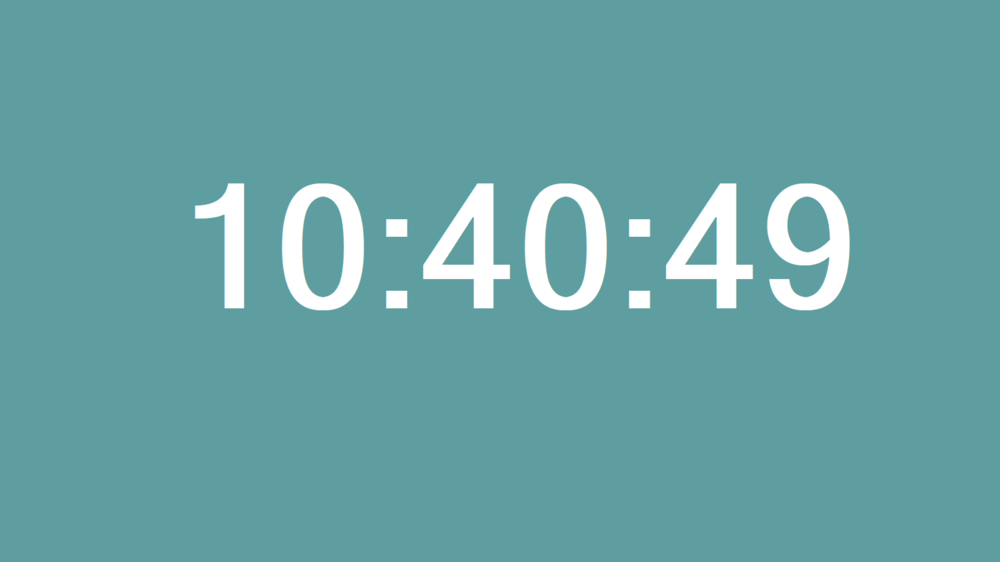

# 制作一个屏保

> 最近跟着**中国大学MOOC**学习C#
>
> 课程来源：《c#程序设计》，北京大学唐大仕老师
>
> https://www.icourse163.org/course/PKU-1001663016
>
> 以下为作业



> 完整代码：https://github.com/yangyang0126/CSharp/tree/master/ScreenSaver

```c#
using System;
using System.Collections.Generic;
using System.ComponentModel;
using System.Data;
using System.Drawing;
using System.Linq;
using System.Text;
using System.Threading.Tasks;
using System.Windows.Forms;

namespace ScreenSaver
{
    public partial class Form1 : Form
    {
        public Form1()
        {
            InitializeComponent();
        }

        int deltX = 10;
        int deltY = 8;

        private void timer1_Tick(object sender, EventArgs e)
        {

            label1.Text = DateTime.Now.ToLongTimeString().ToString();
            this.label1.Left += deltX;
            this.label1.Top += deltY;
            if (this.label1.Top < 0 || this.label1.Top + this.label1.Height > this.Height)
                deltY = -deltY;
            if (this.label1.Left < 0 || this.label1.Left + this.label1.Width > this.Width)
                deltX = -deltX;
        }
        private void Form1_KeyDown(object sender, KeyEventArgs e)
        {
            Application.Exit();
        }
    }
}
```

