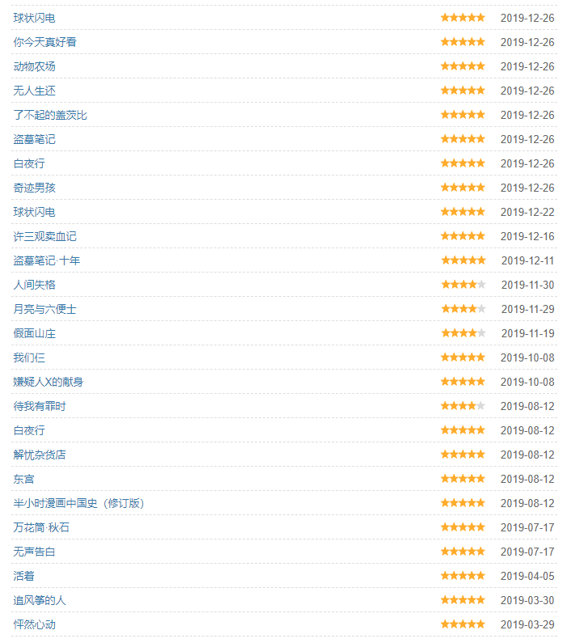
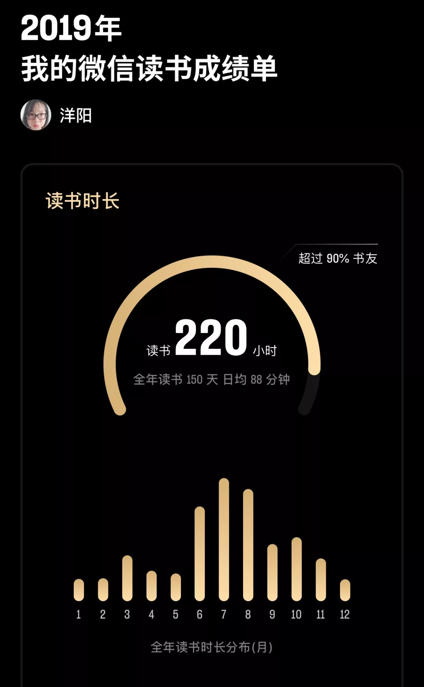
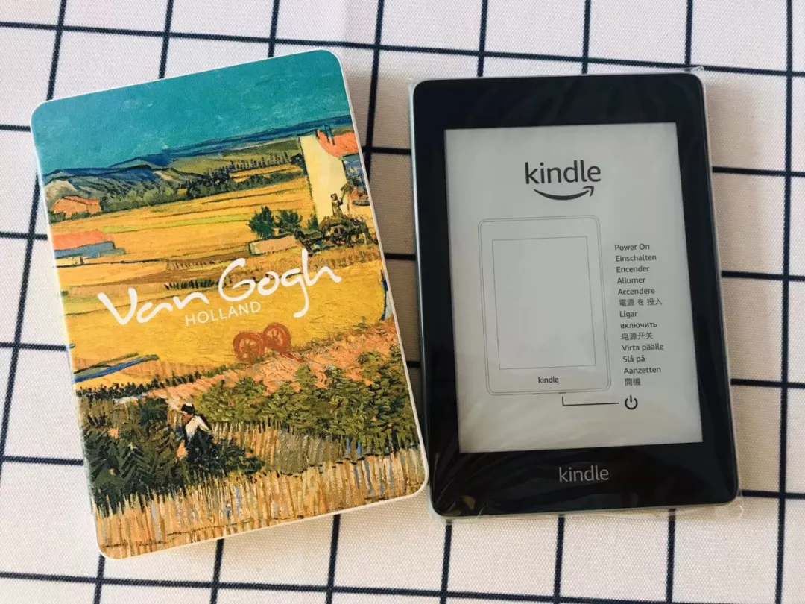
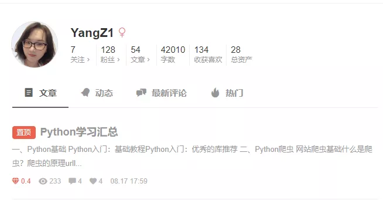
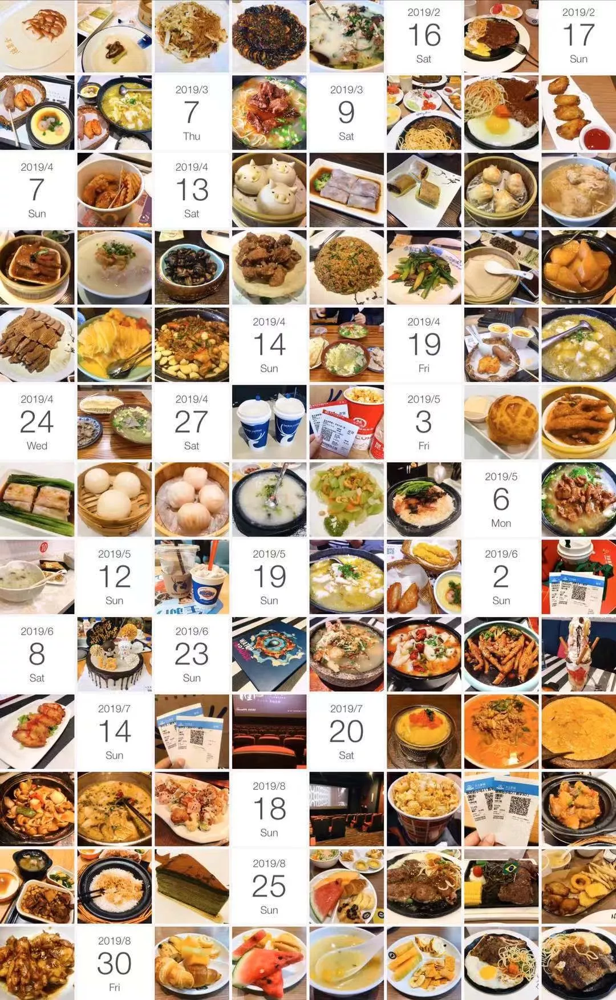

# 准时的自我年度总结 || 2019

今年对我来说，还是改变很大的一年吧。去年我在写[年度总结](http://mp.weixin.qq.com/s?__biz=MzU3NTAzNzA5MA==&mid=2247485132&idx=1&sn=e53bbda7f2ae70ee9315e7da5933b116&chksm=fd280d01ca5f84173e8c0b753317e11b45ea6f5fab184e06370dec25197991a7088eeee0bd83&scene=21#wechat_redirect)的时候说，最开心的，是加入扇贝，认识了新朋友。最烦恼的，是日日加班，身心疲惫。今年，我深刻意识到，一群高质量小伙伴带来的改变。去年我认识的那群小伙伴，在今年，给了我相当大的帮助。

年度关键词：换工作、读书、编程、吃喝玩乐

## 换工作

首先，我觉得换工作是最大的一件事情。

换工作原因有三：

- 蜀黍不能接受上海苏州高铁往返上下班，要求我回上海

- 长时间的加班+不是很高的薪水，让我自我怀疑

- 无法平衡工作和家庭，更加没有时间提升自我

出于以上原因，我在今年9月份开始找工作，10月份拿到offer，11月份正式离职上任。

在这过程中，扇贝的小伙伴帮我内推了我很心仪的公司，后来因为一些原因没去，依旧非常感谢。

目前公司在北京，我常驻上海，每月去北京述职。很喜欢。

​        

换工作后，生活发生了质的变化。

- 回到上海，彼此上班都方便了很多，周末可以回家看父母
- 下班比较早，一般五点多就能到家，不需要加班，回家干家务都卖力了
- 时间多了之后，真的很愉快啊，看书、出去玩，都有了时间
- 薪水也有了不小的涨幅，物质文明带动精神文明，哈哈
- 感觉上班都很有干劲~~

## 读书

今年跟着扇贝读书群的小伙伴，读了不少书。豆瓣统计是41本，实际应该更多些，有些言情玄幻小说，我没好意思往上写。

看书基本集中在微信读书，微信读书真是良心APP，下载至今没花过钱，书籍很多，听书功能特别棒。昨天发现，《人类简史》的真人朗读也上线啦～

双十一的时候，我买了个kindle，后面就在kindle上看。特喜欢梵高的套子，看着就有丰收的感觉。

年度好评献给《无声告白》。我们终其一生，就是要摆脱他人的期待，找到真正的自己。这本书写得太细腻了。另外《奇迹男孩》也很推荐，写得是关于善良和勇气的故事。《人间失格》是我今年看过，最没法理解的书。外界评价如此之高，我不敢说这书不好，我觉得是我不行，我没看懂~

## 编程

我今年对编程燃起了莫名的兴趣。4月份开始学Python，基本晚上、节假日，包括国庆节，我都在写代码。秉着Learning by doing，Learning by teaching的精神，我在简书上同步更新我的学习过程。不知不觉，竟然写了4万多字，收获了100多个粉丝，100多个赞，现在看看，也挺骄傲啊。

偶尔收到类似这样的留言，心里就会得瑟的不行，然后更来劲了。

毕竟是今年初学，目前的水平是，能够Python的基本操作、写网页爬虫、自己买服务器建了一个网站。用学到的知识，帮助小伙伴做做PDF转换，下载网络PPT教材、汇总知网文献之类的，挣了一点零花钱。

我的网站首页

## 吃喝玩乐

说完了正事，说说这吃喝玩乐的一年吧。其实也没有一年，大半年我还是忙着加班，没怎么出去玩的。中途去了次香港迪士尼，当了回小公主。

平时唯一的娱乐，就是看电影。蜀黍很喜欢看电影，基本我们都会去电影院看。看个电影，喝杯咖啡，就是我们一周的娱乐了。2019年新上映的电影，我在电影院看过28部。今年有很多好电影，我就不推荐了，毕竟我看电影都当娱乐消遣。

今年出去吃饭不多，也没有探店了。基本是父母过来，或者和朋友聚会，找熟悉的餐厅吃吃。和蜀黍两个人，要不自己做饭，要不就老盛昌吃个小馄饨~

想说说今年入的一堆厨房用品，包括洗碗机、面包机、豆浆机、空气炸锅、电蒸锅。科技改变生活，有了扫地机和洗碗机之后的生活太美妙，厨房电器也很大程度地提高了生活幸福感。我不太会用烤箱，感觉有些鸡肋。强推电蒸锅，蒸速冻包子什么的超好用。面包机和空气炸锅也不错，挺好用的。

## 最后

这一年，我和蜀黍都过得很好。我就业顺利，蜀黍减肥顺利。2020年，和蜀黍，还有扇贝的小伙伴，继续一起加油。

2020年，我的flag是

- 每周能运动运动，不要变胖
- 工作顺利，多学知识
- 多看书，学着静心
- 买了英语外教，希望口语能有提升
- 还有一个保留心愿

最后，希望大家这一年也都顺顺利利，2020年，更加顺利！