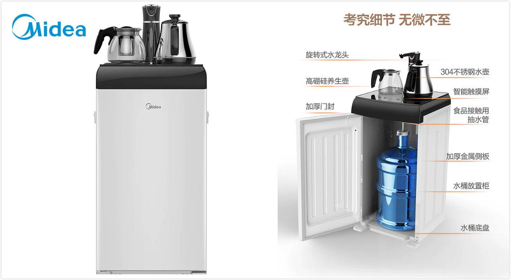
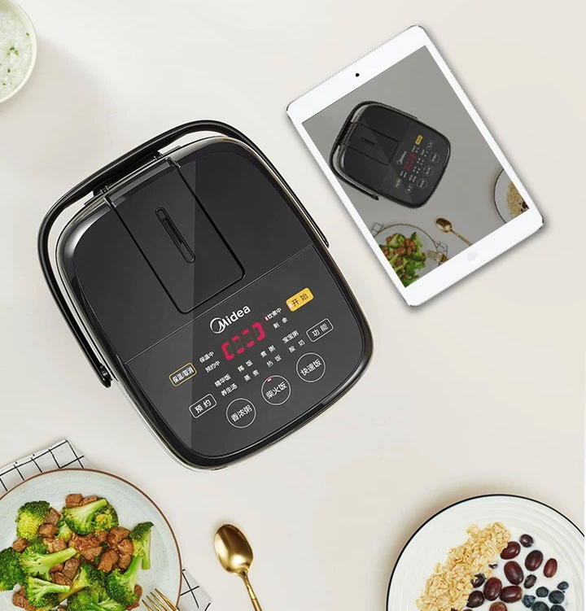
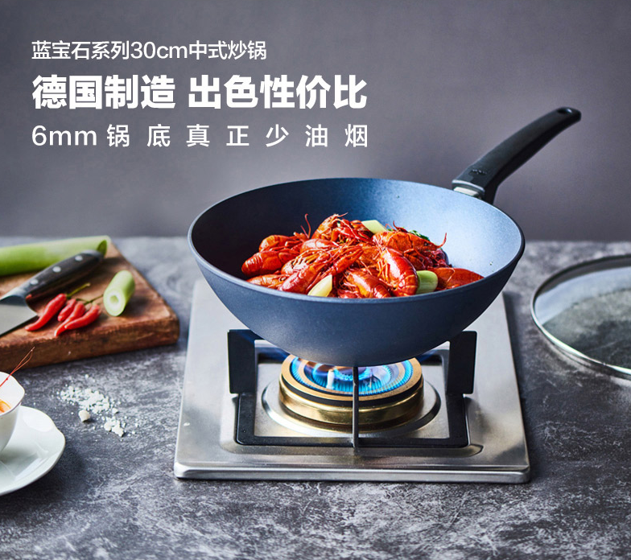
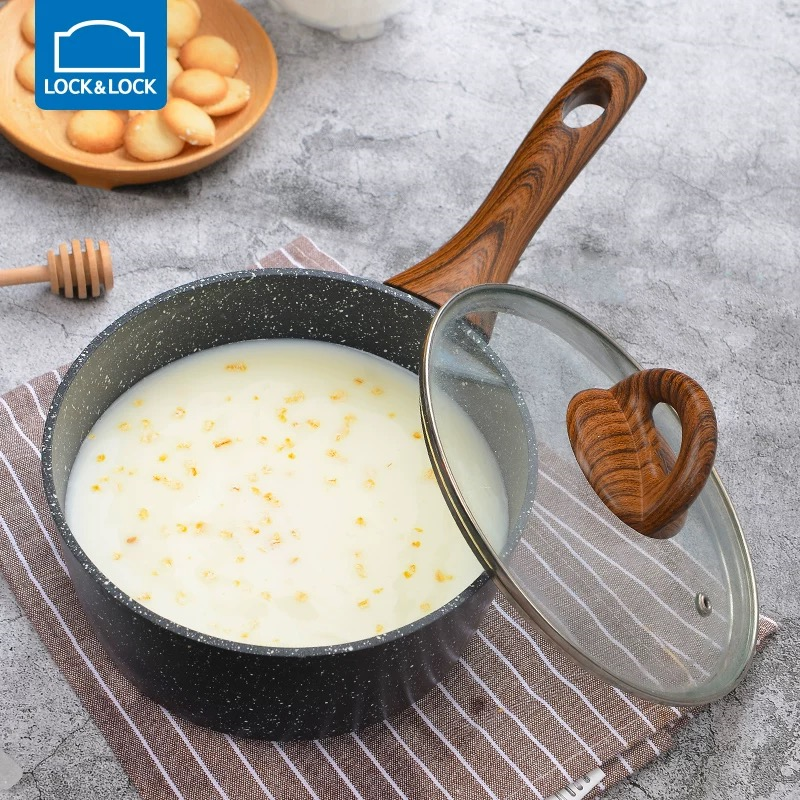
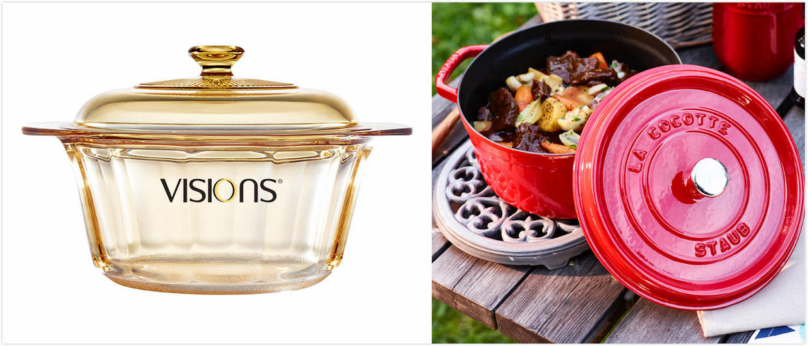
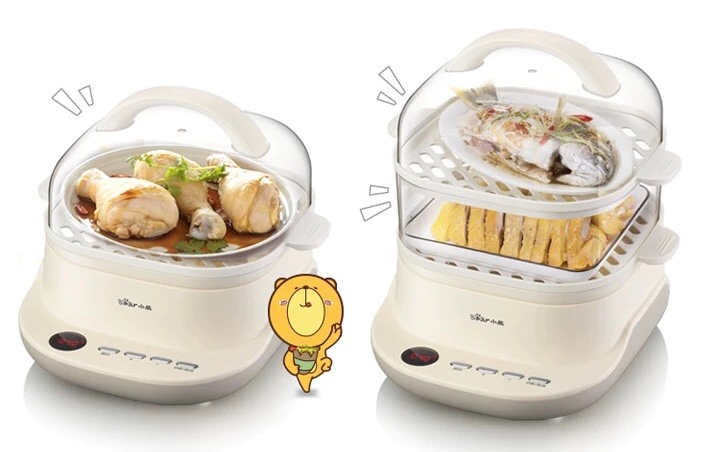
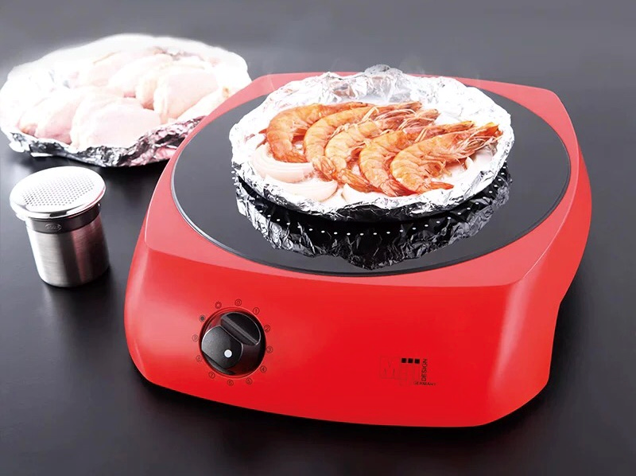
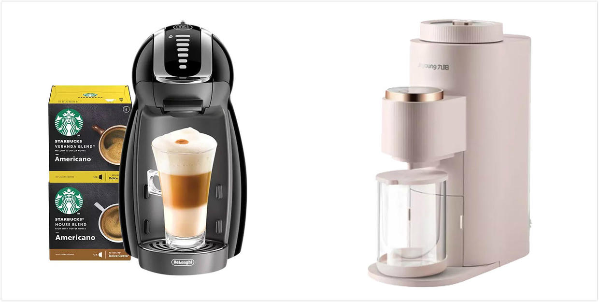
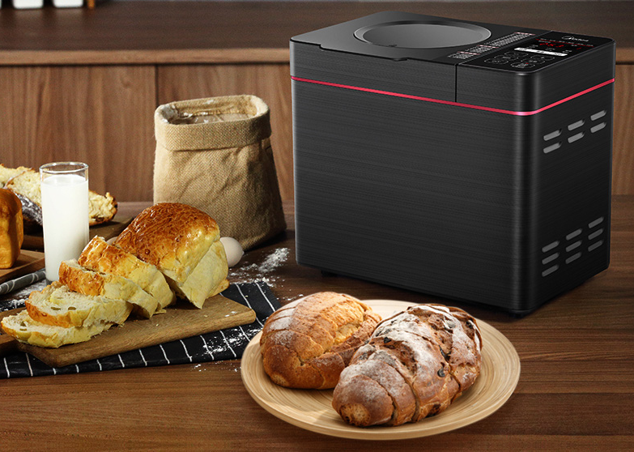
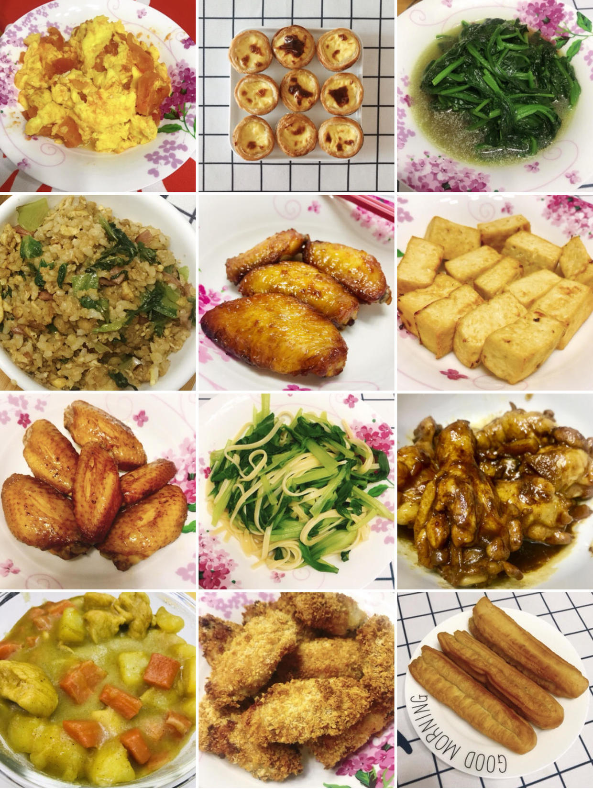

# 那些年，我买过的厨房用品

## 写在前面的话
上一次讲到，那些年，我买过的[家用电器](Life/1.md)，我个人是强推**洗碗机**和**扫地机器人**的。这一期，打算讲讲，这些年，我在厨房上花的钱~

我觉得厨房用品，也不存在鸡肋不鸡肋这种说法，因为好不好用，完全是因人而异的。比如有些小伙伴很擅长烘焙，那烤箱就是必须的。比如我，不擅长这个，那烤箱对我来说，使用频率就很低。

我不是做饭达人，所以我买的厨具，基本是以简单、好操作为主的（主要为了降低做饭难度，能填饱肚子）。这一期，就分为，**居家必备**和**有钱就买**吧。自己的厨房，自己做主~

## 居家必备

### 1）饮水机
先说一个我觉得超方便的饮水机，毕竟大家都要喝水嘛。**美的**这款饮水机茶吧，当初买的时候￥649，现在出新款了，价格差不多。它有两个很方便的地方，一个是烧水壶和保温壶，是配套在上面的，可以保持50度恒温。第二个，它的水桶是放在下面的，不用搬上去，适合女孩子。最后，外形也好挺好看的。当然，你买更贵的，那种几千的，就更洋气了~

### 2）电饭锅
说起电饭锅，大家基本都觉得**虎牌**的比较好，不知道是不是运气不好（或者买的不够贵），用过两个虎牌的电饭锅（东方购物买的），使用感觉都一般。煮饭垫底，煮粥还会喷出来。。我觉得，还不如**美的**。。美的的价格，大概只有虎牌的十分之一，但是真的感觉蛮好用的啊！这次我为了租房子，特意买了一个迷你款的，2L容量199元，感觉超好用。完全不粘锅，特好洗。小小的，很方便，还可以做酸奶。

### 3）各种锅
先说炒锅。论耐用，那肯定要买**双立人**的，但是刷起锅来真是要老命（要么扔给洗碗机洗）。我很喜欢**WOLL**家的不粘锅，价格一千左右，优点是超级好洗、好用。缺点是，这锅不能放电磁炉上。要是配电磁炉，你就得专门买一个电磁炉专用的。

接着说奶锅。乐扣乐扣的泡面不沾小奶锅，是我心头好。煮个面，煮点小东西，太完美了。还特别好刷。价格也不贵，我买的时候只要￥68，一人食必备。

最后各种炖锅。我不喜欢**康宁锅**，感觉又贵又难用，主要是难洗，太沾。至于红透天的**珐琅锅**，我自己是没有买过，我爸一直在用，他经常炖红烧肉什么的，表示好评。至于我自己，觉得一个WOLL的不沾锅就行了，也能红烧，不想花几千块，再去买珐琅锅了。

### 4）电蒸锅
我基本是靠一个不粘锅走天下的，但是不得不说，我们还是需要一个电蒸锅！我之前是没有买过电蒸锅的，对于我没用过的东西，我都是先买个便宜的来试水。小熊双层电蒸锅，只要￥159。买回来之后，除了是塑料的，看着廉价一点，真的超好用！早上起床，有热腾腾的包子吃，太幸福了~（买了电蒸锅，就不用买煮蛋器了。我买了九阳的迷你煮蛋器，￥49，感觉也不便宜）

### 5）炉子
来说个坑吧。**电磁炉**大家都知道。因为我当时要租房子，没有燃气，只能用电。而我只有一个不粘锅，不能放在电磁炉上，所以我想买个**辐射炉**，因为听说这个辐射炉，所有的锅子都能放上去。**米技**这个辐射炉，要一千多，看着好看，我想应该也好用吧，毕竟这么贵啊。事实是，超级难用。温度上不来，水煮不沸。要煮个咖喱或者红烧，能急死你。因为煮的慢，还费电。。总之，别入。。

## 有钱就买
说完了实用产品，就来说说那些，可买可不买，但是买了，还是觉得很开心的东西。
### 1）各种饮料机
推荐两个，**雀巢胶囊咖啡机**1052.36元，**九阳Ksolo破壁豆浆机**1189元。这两个我觉得还是很棒的。咖啡机可以做咖啡、巧克力和奶茶，奶泡很细腻。豆浆机可以做豆浆、果汁和温水，豆浆也很细腻，哈哈。这两个都是一杯的量。如果家里人多的话，还是推荐买个大一点的。这款豆浆机还有个缺点，不能预约。优点就是，可以自清洗，超方便。

### 2）烘焙系列
烘焙是个大坑，这钱就没底了。我买过一个西门子的**烤箱**，￥5800，进口的老贵了。但是买回来之后，除了烤蛋挞，也没有什么太大的作用。还是建议大家量力而行，买之前多三思吧。

我和蜀黍都很喜欢吃面包（我更喜欢吃蛋糕），所以三思之后，我们还是买了个**面包机**。买的美的的，价格￥369。为啥又是美的呢，因为便宜。。买回家之后发现，倒是很实用啊。把材料全都倒进去，早上就可以有一个香喷喷的面包了。很松软，不输面包店的。热的更好吃！实验过几次，不会失败的。缺点是，动静太大了。我是预约晚上做，早上吃。晚上和面，我在二楼都被它震醒了。。还是白天做好，防止扰民。。

另外，我买了一个**飞利浦空气炸锅**，价格￥699。怎么说呢，在尝鲜之后，我感觉不是非常实用。因为很小，也就只能炸炸薯条、烤蛋挞这种小东西。日常做饭，我尝试过鸡翅、牛排这些，但是感觉口味一般，有点中看不中吃的感觉。就我自己生活的话，倒也没有闲置它，我还挺喜欢吃蛋挞这些的，放个四个，倒也合适。另外买的炸鸡什么，可以烤一烤，去潮变脆。

## 最后
就我自己的一点经验吧，厨房用品，是个大坑，永远可以买不完的买。就光碗筷，你都可以买好多花色呢。

所以建议，能不买就不买，买完闲置在家，就很浪费。我也有很多闲置的，比如烤箱、榨汁机、搅拌机、电炖锅什么的。这有些历史遗留问题，当时装修房子，我爸也帮我添置了很多。事实是，我只需要一个不粘锅。。

还有刀具，我感觉，来一把切菜刀，一把水果刀，就行了。我爸给我添置了一大套双立人的刀具和餐具，三年了，我从未用过。。

家里东西越少，越整洁，越干净。厨房也是~
（附上我的菜，厨艺不佳，继续努力~）

