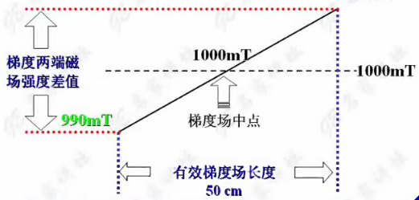
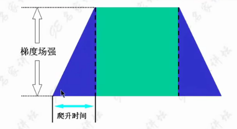
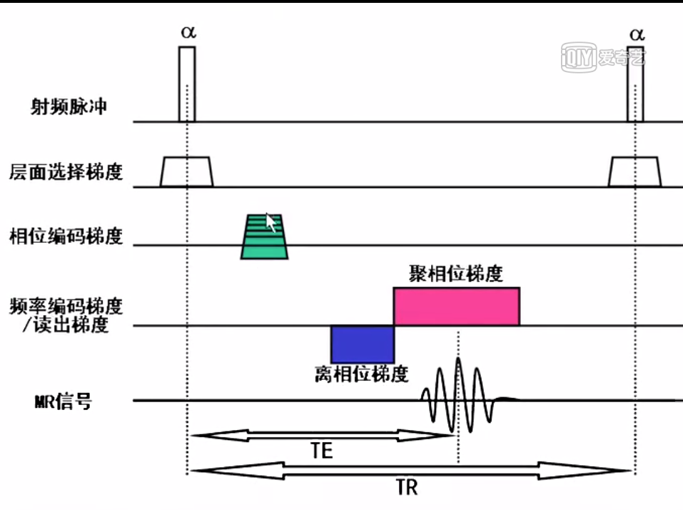
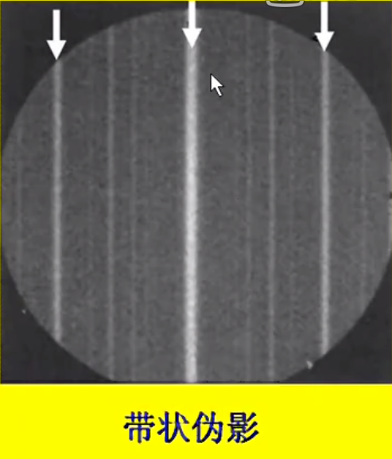
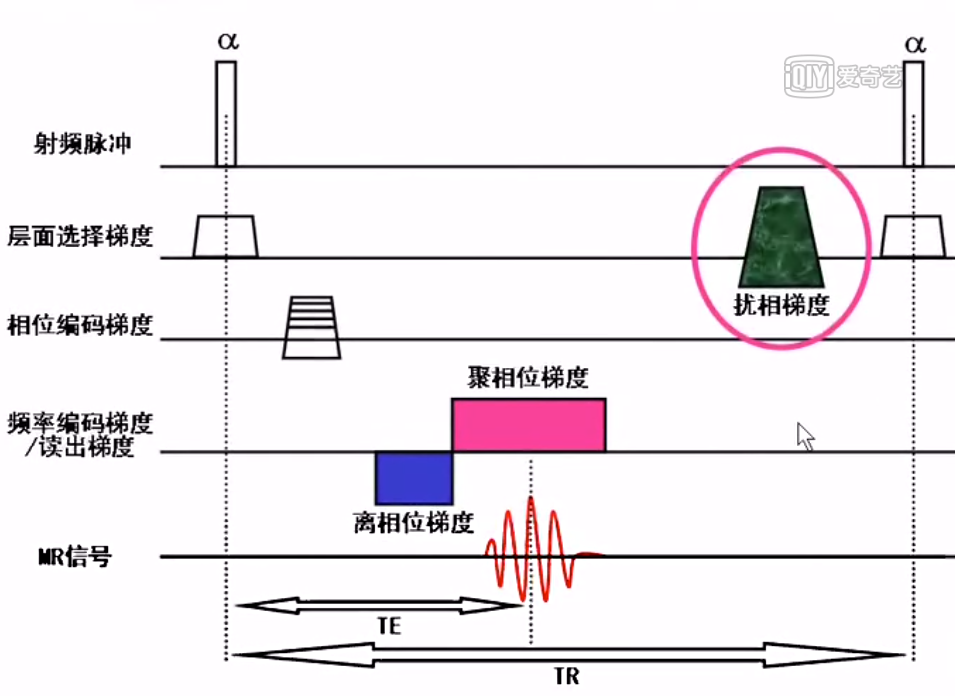
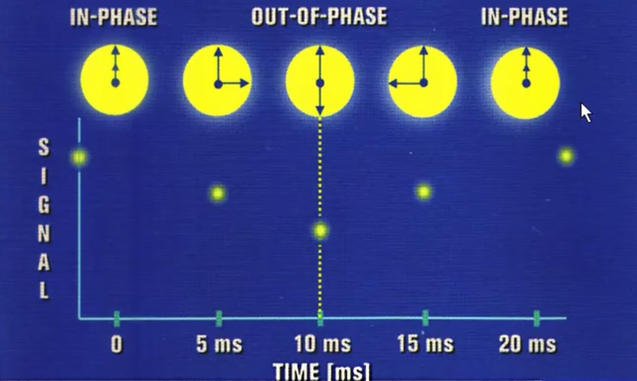
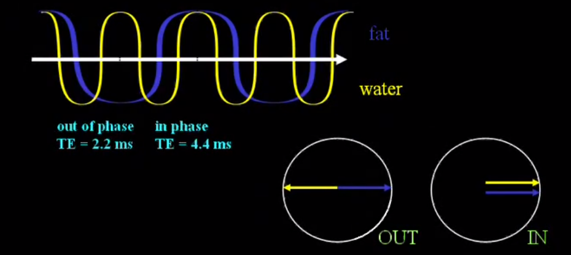
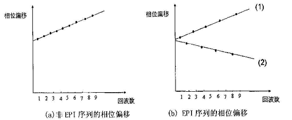
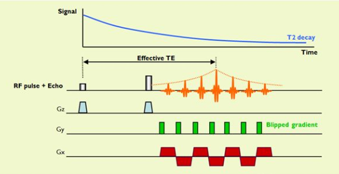

参考：[核磁共振视频教学](http://www.iqiyi.com/w_19rv6ayunx.html)

## 一般的MRI仪器组成

- 主磁体
- 梯度系统
- 脉冲系统
- 计算机系统
- 其他辅助设备

## 主磁体

按磁场产生方式分类：

- 永磁  （0.35T 永磁磁体）
- 电磁
  - 常导  （铜等材料，目前不太用了）
  - 超导  （1.5T超导磁体）

根据外形分类

- 开放式磁体
- 封闭式磁体（目前临床上用的比较多）
- 特殊外形磁体

按主磁场的场强分类

（MR信噪比与主磁场场强成正比，场强越高，信噪比越好）

- 低场：<0.5T
- 中场：0.5T—1.0T
- 高场：1.0T—2.0T（1.0T、1.5T、2.0T）
- 超高场：>2.0T（3.0T、4.7T、7T）

高场强的优缺点：

| 优点                           | 缺点                                  |
| ------------------------------ | ------------------------------------- |
| 提高SNR值                      | 成本、价格增高                        |
| 高SNR前提下，加快采集速度      | 噪音增加                              |
| 波谱分析物质区分能力增强       | SAR值增加（射频能量与场强的平方成正比 |
| 更容易进行脂肪抑制             | 伪影增加（运动、磁敏感、化学位移）    |
| 增加BOLD效应（血氧饱和度依赖） |                                       |

高斯（gauss，G）

- 1高斯：距离5安培电流的直导线1厘米处检测到的磁场强度

- 赤道附近大概是0.3 Gauss，北极附近大概是0.7 Gauss

特斯拉（Tesla，T）

- 奥地利电器工程师，物理学家，旋转磁场原理及其应用的先驱者之一

- 1T=10000G

为什么需要高度均匀的主磁场？

- 空间定位需要
- 提高信噪比
- 减少伪影
- 大视野扫描
- 频谱分析需要（利用进动频率的微小差别）
- 脂肪抑制需要

频率半高宽

理想的主磁场频率只有一个频率

一般表述范围

- N厘米球表面均匀度

- N厘米球体均匀度

## 梯度系统

组成

- 梯度线圈

- 梯度放大器

作用

- 空间定位
- 产生信号
- 扩散梯度（DWI）
- 流速编码（PCMRI）
- 流动补偿
- 其他作用

梯度、梯度磁场

线性梯度

梯度磁场的产生

梯度系统的发展对于MR快速和超快速成像至关重要

梯度线圈的性能指标

- 梯度场强（mT/M）=梯度场两端的磁场强度差值/梯度场长度

  
  $$
  梯度场强 = （1000mT-990mT)/0.5M = 40mT/M
  $$
  
- 切换率 = 梯度场强/爬升时间

  

切换率越高，所需的爬升时间越短，成像速度越快

梯度场强越高，所需要的作用时间越短，成像速度越快

### 射频系统

组成：

- 射频放大器
- 射频通道
- 脉冲线圈
  - 发射线圈：激发人体产生共振（无线电波）
  - 接收线圈：采集MR信号

接收线圈

- 接收线圈离目标组织越近，接收到的信号越强
- 线圈内体积越小，接收到的噪声越低

## 计算机系统和谱仪

- 时钟
- 频率
- 数据的运算
- 控制扫描
- 显示图像

## 其他辅助设备

- 空调
- 检查台
- 激光照相机
- 液氧及水冷却系统
- 自动洗片机

# 脉冲序列

扰相梯度回波

**为什么要扰相？**

GRE序列，TR比较短，一般小于组织T2。每个TR间期存在M~xy~，都包含`SSFP-FID`（自由感应衰减）和`SSFP-REF`（聚焦）。如果`SSFP-REF`保持稳态，可以利用起来，不需要去除。但是由于采集每个回波时，香味编码梯度是不同的，所以`SSFP-REF`不同，`SSFP-REF`的变化引起图像的伪影，一般表现为带状伪影。消除伪影的一种方法就是去除残留的横向磁化矢量`SSFP-REF`

**如何去除SSFP-REF？**

主要方法是是质子群失相位，从而消除M~xy~，该技术称为扰相技术或毁损技术

主要方法：

- 梯度扰相
- 射频扰相
- 梯度扰相+射频扰相

**不同厂家的名称**

- GE
  - `SPGR`：spoiled gradient recalled acquisition in steady state
- SIEMENS
  - `FLASH`：fast low angle shot
- PHILIPS
  - `T1-FFE`：fast field echo

加权成像及对比参数

加权成像：

- `T1WI`
- `T2*WI`

对比参数：

- `TR`

- `Flip Angle`

- `TE`

  - 决定图像的`T2*`弛豫成分
  - `T1WI`原则上应该选择尽量短的TE，尽量消除`T2*`弛豫对图像的污染
  - `T2*WI`应选择适当长的TE（接近于组织的`T2*`值）

  

反相位图像

## EPI 

### 问题

你要想清楚这样操作背后的机理是什么，氢原子的原始信号上发生了啥，以至于必须重建这么操作

再深一步，用se的原始数据，或图像域画张圆配上随机相位 配上噪声，然后逆变换到k空间，把纯净的k空间数组进行相应的相应的操作，然后看对应图像域发生了啥

k空间啥样的一个调制会引起1/2 1/4 1/8……耐奎斯特伪影

然后耐奎斯特伪影 细分为 b0耐奎斯特 x方向耐奎斯特 y方向耐奎斯特。用matlab 纯净的数据如何操作可以重现这三个独立的伪影

一般系统上都是2个或3个混合在一起出现，那你能否仿真出来

这些问题都想通了 而且都仿真出来 而且能处理掉 那你就进epi世界前10了

### 概念

平面回波成像序列： Echo Planar Imaging

EPI序列是在一次射频脉冲激励后，利用正反相位连续切换采集信号。

严格意义上来讲，EPI不属于序列分类，算是一种信号采集技术，是一种信号读出模式

### Nyquist  ghost

由于磁场的不均匀性，以及EPI通过正反梯度切换快速的读出信号，产生得涡流和化学位移等因素，使得K空间的奇、偶回波之间容易积累相位差，在相位编码方向上产生Ghost伪影。导致图像的变形（distortion）。

奇偶回波产生的K空间偏移方向不同，从而出现相位编码方向得相位震荡，产生Ghost伪影

而EPI序列，如果回波链多了EPI factor也会导致EPI伪影和变形加大；另外，EPI序列没有采用多个180°重聚脉冲聚集信号，对磁化率敏感，容易产生磁化率伪影。

three types  of  Nyquist  ghosts in  single-shot EPI: 

- constant-phase ghost
- linear-phase ghost
- oblique Nyquist  ghost

### 单激发和多激发

| 单激发 Single-shot | 多激发 Multi-shot |
| ------------------ | ----------------- |
| X 分辨率受限       | O 分辨率高        |
| X 图像形变大       | O 图像形变小      |
| X 磁化率伪影重     | O 磁化率伪影轻    |
| O 对运动伪影不敏感 | X 运动伪影重      |

单激发是一次射频脉冲激励以后，通过读出信号的方式采集完一副图像所需要的所有K空间相位编码线。最大的有点是快，可以冻结宏观的运动伪影。目前临床EPI序列应用最多的是做DWI弥散，采用的大部分是单激发。所以腹部弥散，可以完全自由呼吸做而运动伪影却不大，因为单激发对运动伪影不敏感。

### EPI factor

EPI factor：确定每次激励是收集的Ky线的数量

EPI因子越大，SNR越低，同时还会影响磁化率伪影和图像变形，扫描仪产生的噪音

磁共振弥散加权成像（Diffusion Weighted Imaging, DWI），是唯一能够活体检测水分子扩散情况的无创影像检查技术，而且也是临床应用最多的一个磁共振功能监测技术。