# Excel：下拉菜单和数据透视构建记账本

## 写在前面的话
为什么要搞一个记账的Excel？
作为一个经常剁手的人，我日常都有记账的习惯
市面上主流的APP也都下载了
我主要看中两个方面：
1、 能同步银行卡、支付宝、微信
2、界面清爽，各种汇总能力强

最后的感想是：
1、圈子账本好看，但是没法同步
2、网易有钱之前都很好的，但是最近都同步不了银行卡
3、随手记太复杂，对iPhone很不友好（安卓貌似是可以同步银行卡的）

而且，每次换一个APP，记的账都很难同步，导出Excel都要VIP
最后想想，回归本质，我自己做一个吧
除了不能同步银行卡，其他的，我想怎么搞怎么搞

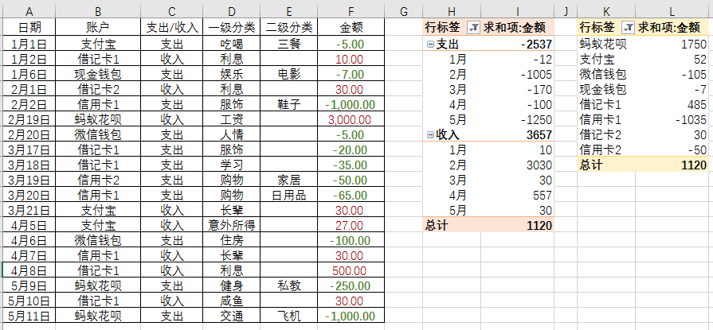

下载链接：
https://share.weiyun.com/5kCwxUB

## 明确内容
首先，你要知道，你想要的一个什么样的账本
基本包括4部分：
- 时间、日期
- 账户（银行卡、支付宝、微信等）
- 支出类别（吃喝、交通、人情等）
- 收入类别（工资、兼职、咸鱼等）

通过数据透视，可以自动统计支出、收入、各个账户明细、各个类别等等

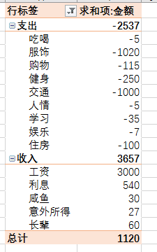

## 设置下拉列表
记账的时候，就这么些项目，没必要每次自己写
直接下拉选选更方便

- 账户：一级列表
- 支出：一级列表+二级列表
（比如吃喝是一级，零食、三餐、买菜是二级）
- 收入：一级列表

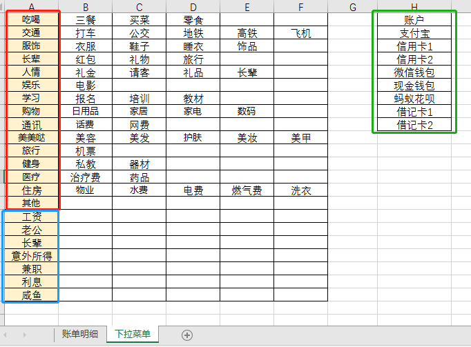

在下拉菜单里面，把你要的类别编辑好

### 设置一级列表

`账户`就是个一级列表，比较容易操作
在另一个sheet里面，点击你要设置的单元格，点击`数据验证`

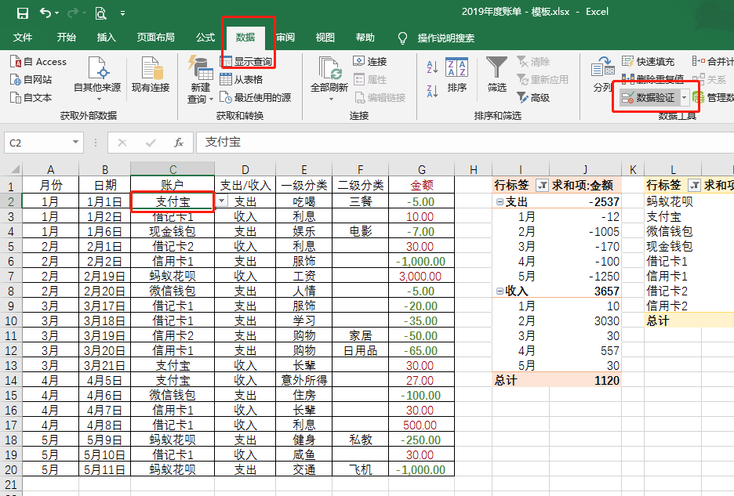

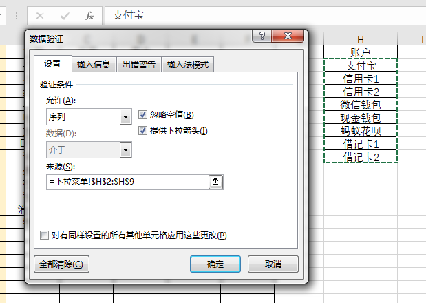

在`允许`里面，选择`序列`，`来源`选择你要的内容，点击`确定`

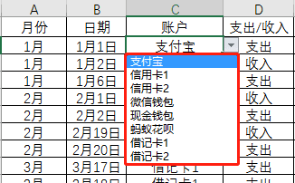

### 设置二级列表
设置二级列表，有2种情况
1、选中，全部设置，包括空的单元格
2、选中，F5，定位条件选择常量，把空格去掉
我个人选择第一种，因为我后面再编辑的话，直接写在空的单元格上，不用重新设置
点击`公式`中的`根据所选内容创建`

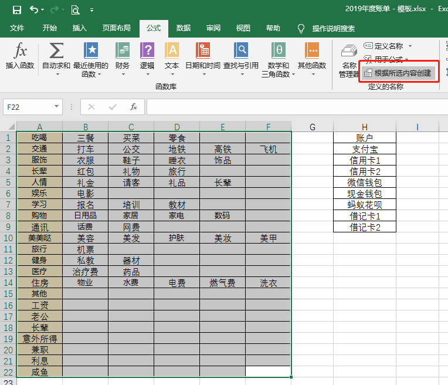

 选择`最左列`，点击`确定`

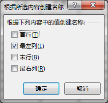

点击`名称管理器`，可以看到，都设置好了
比如工资，没有下设二级菜单，就是空的
如果你不喜欢，可以在设置之前，点击F5去掉空格

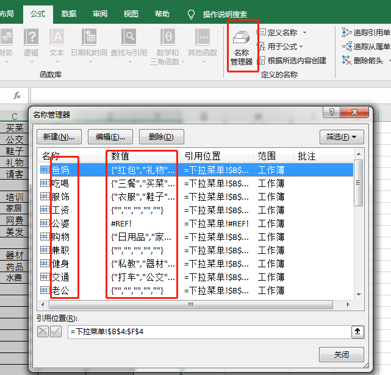

选中我们要的一级列表，手动改个名字，比如：明细

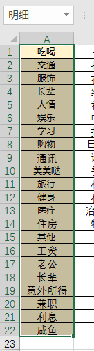

先设置一级分类，和刚刚的方式一样，区别是，直接把来源写成`=明细`

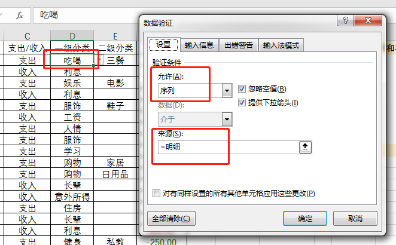

设置二级分类的时候，把来源改成`=INDIRECT(D2)`
因为我这里，一级分类，放在`D2`单元格
根据自己需求调整

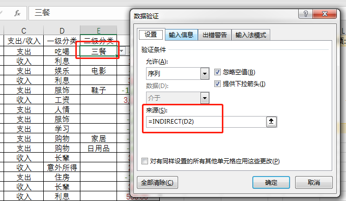

我们来看看效果
在一级分类里选择`服饰`

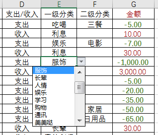

可以看到二级分类里，会自动更新关于`服饰`的下设分类

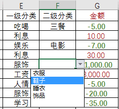

这样，下拉菜单就都设计好了

## 设计条件格式

这里把支出设为了绿色，收入设为了红色

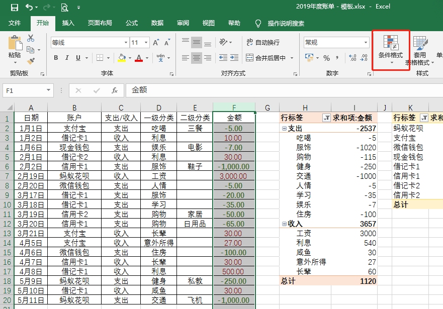

小于0的，代表支出
大于0的，代表收入
条件格式 —> 突出显示单元格规则 —> 大于（或者小于）
我先设置支出，就是选择`小于`
至于样式，每个人喜欢的风格不同，自行选择就好

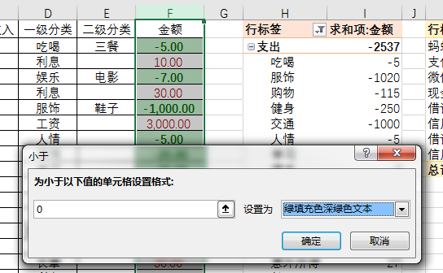

## 数据透视表

表格都设计好了，数据也填上了，下面就是做数据透视表

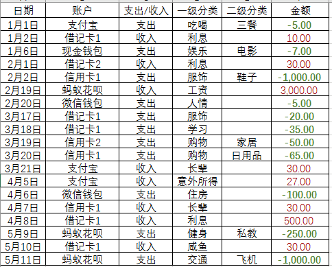

点击一个你要插入表格的位置，然后插入数据透视表

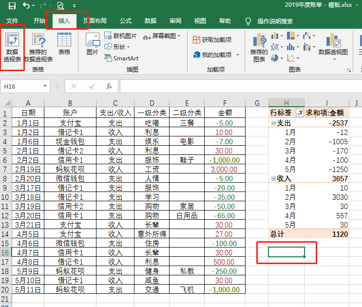

你可以插入好几个数据透视表
就是注意，选择单元格的时候，不要重叠到另一个数据透视表（稍微有点距离）

插入之后，数据就随便你选啦

上图是按月统计支出和收入，你也可以统计类别

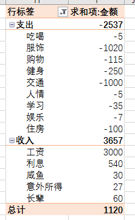

单独统计每个月的支出和收入

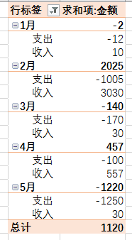

统计更细致一点，把每月的详情都放出来

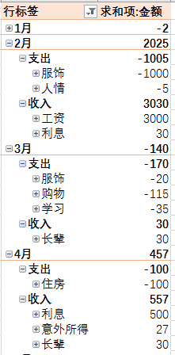

这个数据统计，方式太多，大家就挑选自己想要的
所有的数据，都是可以筛选的
日期可以按季度、年、月等等进行筛选
数字也可以按照百分比等进行显示
更新数据后，可以直接在`行标签`那里，右击刷新
具体操作太多，这里不细说啦

## 最后
愿大家都能攒下钱啦，一起成为记账攒钱小达人~