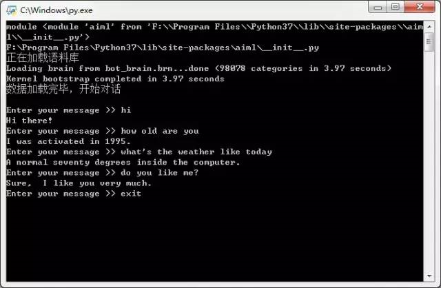
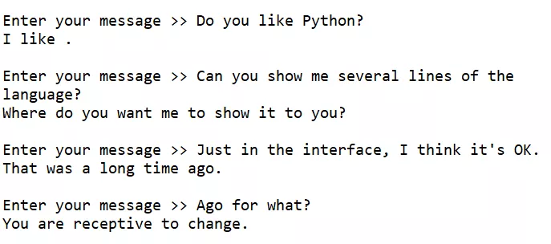

# 用aiml构建英语聊天机器人

## 写在前面的话

- 安装aiml库

- 获取语料库路径

- - 获取aiml的安装路径
  - 补充路径名称
  - 切换到语料库所在工作目录
    （所有的语料库，是可以自己补充修改的，这里就先用现成的）

- 创建机器人alice对象

- 加载语料库

- - 如果是第一次加载语料库，读取数据，同时保存资料至`bot_brain.brn`
  - 如果是之后再加载语料库，就不需要读取所有数据了，直接读取`bot_brain.brn`

- 正式开始聊天

- - 如果遇到用户输入`exit`，就退出聊天

## 运行界面



前面的加载过程，是为了调试。实际使用的时候，可以全部注释掉，直接开始对话。



对话来自小伙伴Xuejing同学和机器人，Xuejing是测试我代码的好伙伴

输入`exit`，程序会自动退出

## 安装库

安装aiml 0.9.2库：https://pypi.org/project/aiml/

```bash
pip install aiml
```

## 完整代码

```python
# -*- coding: utf-8 -*-

# 加载库
import aiml
import sys
import os
 
# 获取aiml的安装路径 
def get_module_dir(name):
    print("module", sys.modules[name])
    path = getattr(sys.modules[name], '__file__', None)
    print(path)
    if not path:
        raise AttributeError('module %s has not attribute __file__' % name)
    return os.path.dirname(os.path.abspath(path))
 
# 补充路径名称 
alice_path = get_module_dir('aiml') + '\\botdata\\alice'

# 切换到语料库所在工作目录 
os.chdir(alice_path)

# 创建机器人alice对象 
alice = aiml.Kernel()

print("正在加载语料库")

# 这里做一个判断
# 如果是第一次加载语料库，就进入else部分，读取数据，同时保存资料至bot_brain.brn
# 如果是之后再加载语料库，就不需要读取所有数据了，直接读取保存数据bot_brain.brn
if os.path.isfile("bot_brain.brn"):
    alice.bootstrap(brainFile = "bot_brain.brn")
else:
    alice.learn("startup.xml") # 加载...\\botdata\\alice\\startup.xml
    alice.respond('LOAD ALICE') # 加载...\\botdata\\alice目录下的语料库
    alice.saveBrain("bot_brain.brn")
print("数据加载完毕，开始对话\n")

# 正式开始聊天 
while True:
    message = input("Enter your message >> ")    
    if ("exit" == message):# 如果输入exit，程序退出
        exit()
        response = alice.respond(message) # 机器人应答
        print(response)
        break # 结束循环
    response = alice.respond(message) # 机器人应答
    print(response)
```

## 参考资料 

1. [用AIML实现的Python人工智能聊天机器人](https://www.jianshu.com/p/6f35a626d41a)