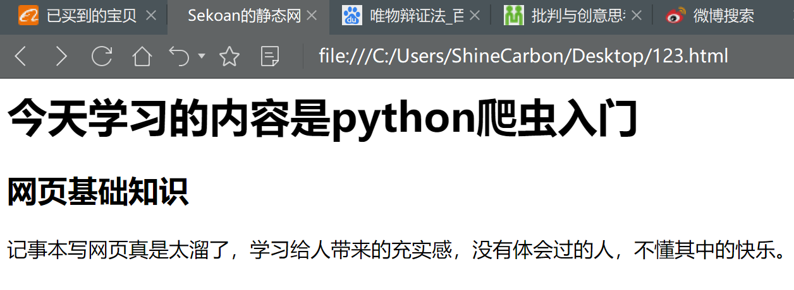
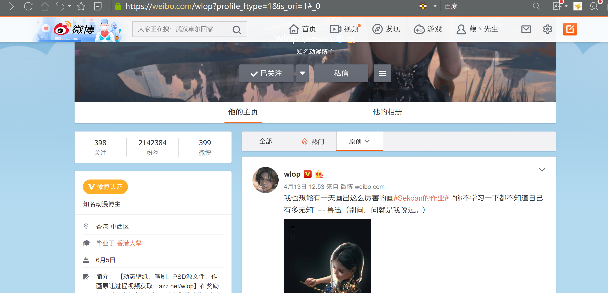

> 本单元视频链接：https://v.youku.com/v_show/id_XNDY0OTI2Nzk2NA==.html
>
> 视频密码：yang
>
> 清晰度默认是标清，可以调成超清
>
> 注：视频里说，静态网页用get，动态网页用post，这个说法是**错误**的！！**错误**的！！！具体用get还是用post，看网页上的`Request Method`

# 一、什么是爬虫？

爬虫是**自动化**帮我们获取网页数据的程序

简单来说，用爬虫，去获取网页数据

那么，我们大概需要这么几个步骤

- 明确目标：首先确定，我们要爬虫什么内容
- 打开网页：确定网页网址，得到网页响应
- 定位数据：找到我们需要的数据
- 清洗数据：把我们要的那部分数据截出来
- 保存数据：把数据保存到EXCEL或者txt

**在学习爬虫之前，你需要有那些技能？**

你需要掌握Python的基础语法，包括For循环、if判断、字典、列表、字符串等操作。如果你还不会，可以戳：[Python基础教程](Python/basic.md)

## 明确目标

第一步，你需要知道，你要爬的内容是什么，比如，扇贝打卡数据、豆瓣排行榜、淘宝链接等的，然后找到这个网址。

## 打开网页

我们首先明确一点，一个网站上那么多东西，不是存在这个网址上的，而是存在一个服务器上的。这个网址，对应着这个服务器。如果大家理解不了，可以粗暴一点，把服务器理解为一个网上的云盘。

举个例子，比如我们在电脑上存了好多东西，这时候有一个路径，比如`D:\Coding\blog`，在这里路径下面，我存了几百个关于我博客的文件。那不代表，这个路径等于我的文件，但是通过这个路径，可以访问到我的文件

一般我们在浏览器输入一个网址，浏览器会去访问这个网址对应的服务器，这个过程叫请求（request）。请求成功后，服务器把网站内容返回给浏览器，这个过程叫响应（response）。

这一步，其实是爬虫最难的一步~

## 定位数据

获取到网页内容后，你需要定位，你想要的数据在哪里，这需要一点点网页前端的知识。

另外我们可以借助一些库，比如`BeautifulSoup`，或者正则化表达等，更快的定位数据。

专业一点说，这叫解析和提取。

## 清洗数据

把基础课程中，各种字典、字符串、列表的方式都用起来，把数据清洗成你喜欢的方式

## 保存数据

通过一些简单的操作，讲数据保存到Excel表格里

# 二、网页类型

首先，网页类型分为两种，静态和动态的

| 静态页面                                    | 动态页面                       |
| ------------------------------------------- | ------------------------------ |
| 非结构化数据：HTML                          | 结构化数据：json，xml等        |
| 处理方式：正则表达式，xpath，beautifulsoup4 | 处理方式：直接转化为python类型 |

以[豆瓣电影 Top 250](https://movie.douban.com/top250)为例，它的网址是：https://movie.douban.com/top250

**360浏览器：**右击“审查元素”，打开开发人员工具


我们可以看到，请求方式（Request Method）是GET。有些网页，比如扇贝登入界面，请求方式（Request Method）是`POST`。我们后面会遇到`POST`的情况。

注：视频里说，静态网页用get，动态网页用post，这个说法是**错误**的！！**错误**的！！！具体用get还是用post，看网页上的`Request Method`

# 三、发起请求

发起请求，我们一般用 `requests`库。如果你还没有安装的话，可以`pip install requests`

安装和版本，可以看pypi官网：https://pypi.org/project/requests/

关于 `requests`库的详细说明，可以看官网：https://requests.readthedocs.io/en/master/

```python
import requests  # 获取网页数据的库
url = "https://www.shanbay.com"  # 网址
res = requests.get(url)  # 静态网页，用get发起请求
print(res)  # 查看响应情况
# 输出：
# <Response [200]>
```

这时候，我们将网页的响应存到了`res`这个变量中，我们来看一下这个变量

```python
res.status_code # 响应的状态码
res.text  # 响应内容的字符串形式
res.content  # 响应内容的二进制形式
res.encoding  # 响应内容的编码
```

## status_code

`status_code `是状态码，一个正常响应的网页，状态码是**200**

一般如果状态码是4开头的，是客户端错误。比如404，找不到相关资源

如果状态码是5开头的，是服务器错误。比如503，服务不可用

如果大家遇到相关的报错，可以直接百度，就能知道问题

## text

`text` 就是把内容输出，包括中英文字符


可以用来下载文本内容

## content

`content` 把内容变成二进制格式


可以用来下载图片、音频、视频等二进制内容

## encoding

`encoding` 是内容的编码形式，比如扇贝这个是`utf-8`

还有很多其他的编码，比如 GB2312、GBK、Unicode、ASCII等等

如果你发现你`res.text`出来的中文字符全都乱码了，你可以修改一下`encoding` 

举个例子，我们来爬一下百度

```python
import requests
res = requests.get('https://www.baidu.com')
print(res.text)
```


这时候的输出就很奇怪，里面混着奇怪的字符

我们输出`res.encoding`的时候发现，他这时候编码是的是`ISO-8859-1`

```python
print(res.encoding)
# 输出：
# ISO-8859-1
```

系统一般是根据内容，自动推测是什么编码格式的。但有的时候会推测错误，我们就需要手动改回来

```python
import requests
res = requests.get('https://www.baidu.com')
res.encoding = "utf-8"
print(res.text)
```

这时候，中文字符显示就正常了


# 四、爬虫类型

不同的网页，爬虫方式都是不同的

比如豆瓣电影排行榜，是静态网页，可以直接获取

而动态的网页，你需要用API获取数据

比如博客，需要登入操作；登入之后，需要保存你的登入状态

还有一些网站，需要用`selenium` 模拟浏览器

# 五、HTML

一个网页的本质，是一个`HTML` 文档，我们可以通过右键点击 【显示网页源代码】 看到。有的浏览器叫【查看源代码】，各个浏览器的叫法有点不同。

网页开发，也叫Web开发，或者前端开发，他们需要同时掌握HTML、CSS、JavaScript。HTML负责网页的内容，CSS类似排版做样式，JavaScript负责网页的一些交互动作。


## 元素

h1：一级标题

h2：二级标题

p：段落标签

a：超链接

img：图片

div：定位文档的块区域

打开一个记事本，输入下面的代码

```html
<html>
	<head>
		<meta charset="utf-8" />
		<title>做一个网页</title>
	</head>
	<body>
		<h1>这是标题一</h1>
		<h2>这是标题二</h2>
		<p>这里可以放段落</p>
		
        <p>这里可以继续放段落</p>
		<a href="https://blog.zhaojingyi0126.com/#/">可以插入一个博客链接</a>
	</body>
</html>
```

保存文件的时候，后缀格式从`.txt`  变成`.html`，直接双击打开即可


## 属性


图片来自扇贝编程

除了 **href** 属性和 **src** 属性外，HTML 中还有两个很常用的属性——**id** 和 **class**

# 六、如何修改网页

以朱一龙的微博为例：https://weibo.com/zhuyilong?is_hot=1

点击左上角，有一个箭头的那个标志，然后点击网页，你需要修改的内容。直接改就行

图片注意链接，用新浪上的图片


来修改一下这个微博状态


# 七、实践

1、做一个网页，内容随意。但是要包括标题、段落、图片、和链接，这最基础的4部分。图片可以百度，然后用链接。请在内容里，标明昵称（你可以用昵称作为网页的名称）

2、改一个微博，内容随意，内容里包含昵称

# 八、作业展示






