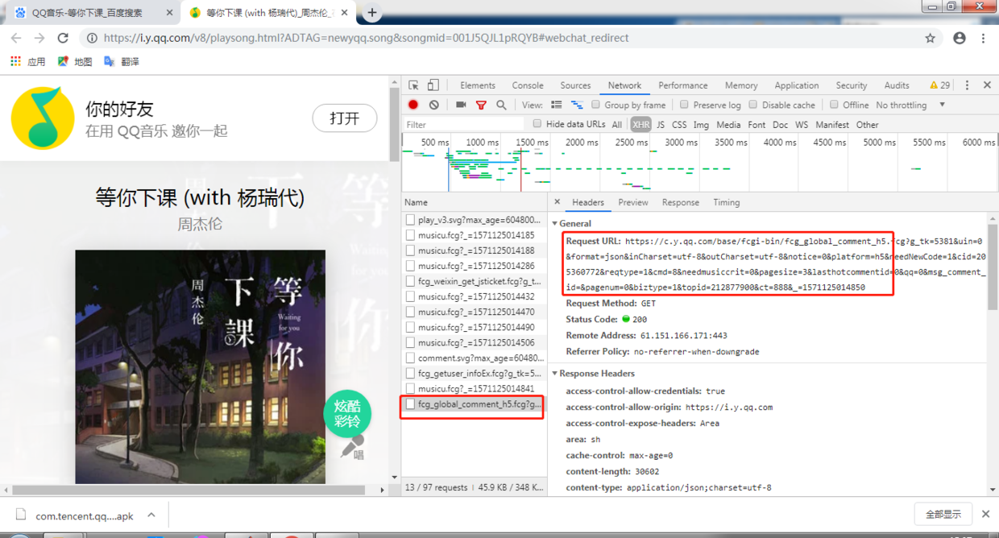
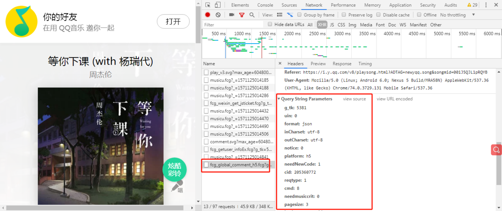

# 爬虫：QQ音乐评论

以QQ音乐，[等你下课](https://i.y.qq.com/v8/playsong.html?ADTAG=newyqq.song&songmid=001J5QJL1pRQYB#webchat_redirect)为例

## 完整代码
```python
import requests

headers = {
  'user-agent': 'Mozilla/5.0 (Windows NT 6.1; Win64; x64) AppleWebKit/537.36 (KHTML, like Gecko) Chrome/74.0.3729.131 Safari/537.36'
}
params = {
  'g_tk': '5381',
  'loginUin': '0',
  'hostUin': '0',
  'format': 'json',
  'inCharset': 'utf8',
  'outCharset': 'GB2312',
  'notice': '0',
  'platform': 'yqq.json',
  'needNewCode': '0',
  'cid': '205360772',
  'reqtype': '2',
  'biztype': '1',
  'topid': '212877900',
  'cmd': '8',
  'needmusiccrit': '0',
  'pagenum': '0',
  'pagesize': '25',
  'lasthotcommentid': '',
  'domain': 'qq.com',
  'ct': '24',
  'cv': '10101010'
}
res = requests.get('https://c.y.qq.com/base/fcgi-bin/fcg_global_comment_h5.fcg', headers=headers, params=params)

data = res.json()

for item in data['comment']['commentlist']:
  print('{}：{}'.format(item['nick'], item['rootcommentcontent']))
```
## 代码说明

参数`params `在哪看？
网页右击“检查”，打开界面



往下翻，把参数全都粘贴下来

