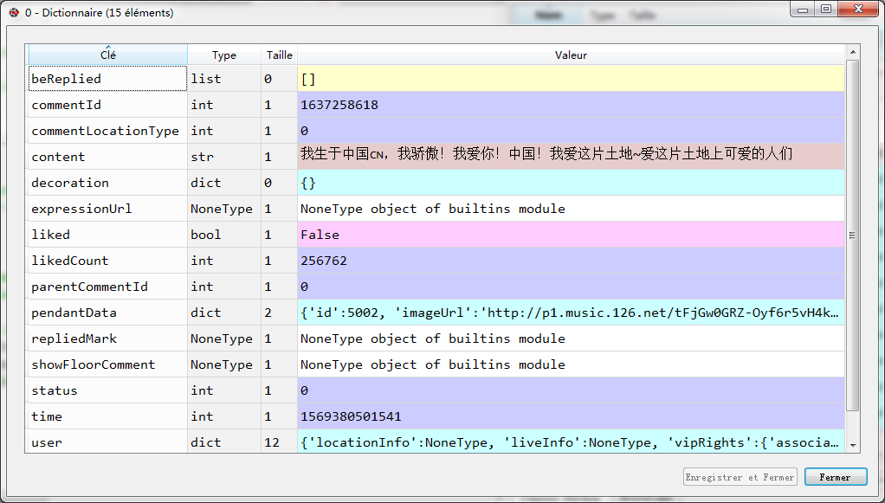

# 爬虫：网页云音乐评论

完整代码

```python
import requests

headers = {
        'referer': 'https://music.163.com/song?id=1392990601',
        'user-agent': 'Mozilla/5.0 (Windows NT 6.1; Win64; x64) AppleWebKit/537.36 (KHTML, like Gecko) Chrome/74.0.3729.131 Safari/537.36'
}

params = {
        "params": "uDLzYGLcTNCjLjdCW+9IichJlH11qTKrVpnGQoJy6sFBtlEovOycsJ8CZZ+BKvM31A9o60Ur69YS1sCQiiI8ySaGicLsHF2L69/Fb/7msPFRCeXt2L//zPjdd4JbHqThXk/yD5UUmb4nF2jfXO8pkWyNJUSgKrCM4/1hPCbOd3oIX+F0ThM4D9J9yg8DVSVD",
        "encSecKey": "4ad59dea31c7272fa1cfb8ba95bb55ca77947327398f46b1cb30ca0dfdb55a6241d3ec670965b203ab48c3cc453f98c2542399a5d9112920e03d0e291ef26f9c24327c5dedca61d5776065862cfa1cf99c0a692db4c83e33f9052ab1cec047a1f992bfc8a91bd2d8f30dd01bd1ab884c5d3622d4b034e5c4c9d10eba91a11784"
        }

url = "https://music.163.com/weapi/v1/resource/comments/R_SO_4_1392990601?csrf_token="
res = requests.post(url, headers=headers, params=params)
data = res.json()


print(data['hotComments'][0]['content'])
```
## 代码说明

这个代码比价简单，流程就是：
- 找到你要获取的网页
- 右击“检查”，获取`headers `，记得把`refere`r和`user-agent`都贴下来

- `params `和`encSecKey`也都复制下来


你可以看到所有的评论信息都在`content`里面



代码里面，只输出了一条信息，你想输出全部，加个`for`循环就好。如果你不会，可以参考[爬虫：QQ音乐评论](Python/18.md)