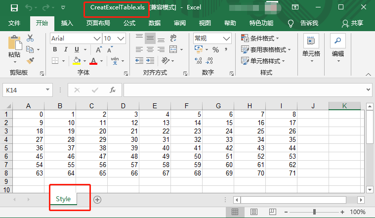
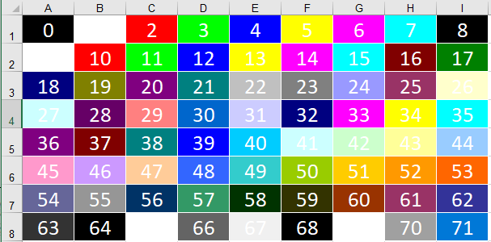
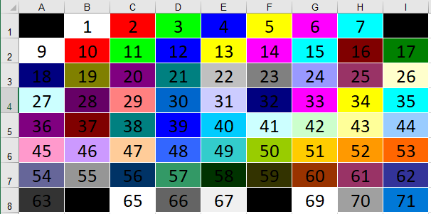
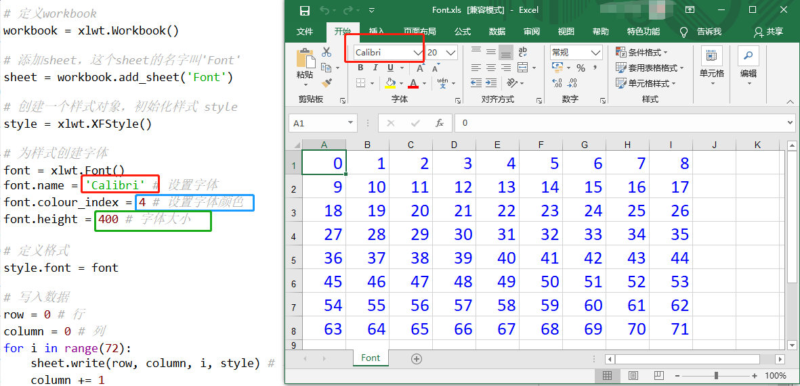
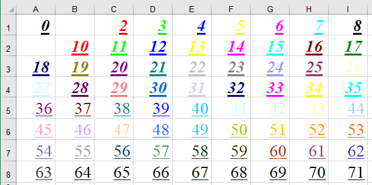
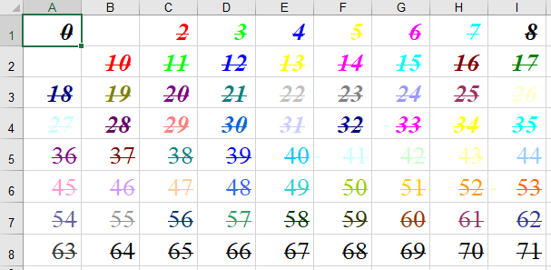
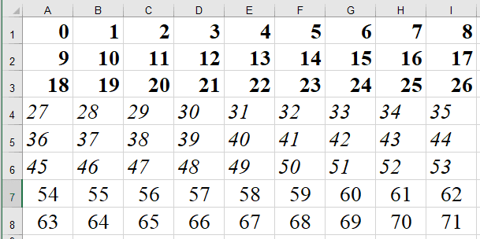
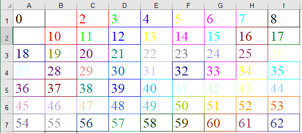
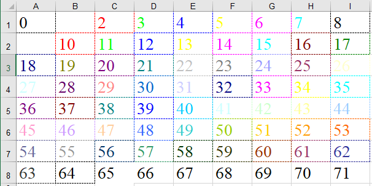
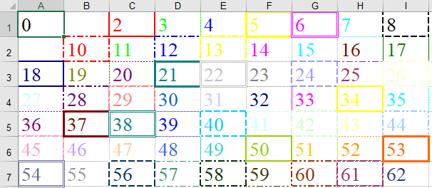

# 利用xlwt设置Excel单元格格式

## xlwt介绍和安装
`xlwt`是Python中操作Excel的一个库，可以将数据保存成Excel
API Reference：https://xlwt.readthedocs.io/en/latest/api.html#xlwt.Style.easyxf
PyPI：https://pypi.org/project/xlwt-fix/
```python
pip install xlwt
```
在保存之前，可以设置单元格的属性，[官网](https://xlwt.readthedocs.io/en/latest/api.html#xlwt.Style.easyxf)提供了以下6种设置。
| Group         | Attributes                                                   |
| ------------- | ------------------------------------------------------------ |
| Number format | Number format index (index to FORMAT record)                 |
| Font          | Font index (index to FONT record)                            |
| Alignment     | Horizontal and vertical alignment, text wrap, indentation, orientation/rotation, text direction |
| Border        | Border line styles and colours                               |
| Background    | Background area style and colours                            |
| Protection    | Cell locked, formula hidden                                  |

此文介绍其中4种：
- Font：字体设置
- Alignment：对准设置
- Border：边框设置
- Background：背景设置

文中所有代码链接：[https://github.com/yangyang0126/PythonLearning/tree/master/Python实践/数据可视化/xlwt](https://github.com/yangyang0126/PythonLearning/tree/master/Python实践/数据可视化/xlwt)


## 创建表格
创建一个表格的流程
- 定义workbook
- 添加sheet
- 创建一个样式对象style，设置格式（这一步可以省略，出来就是默认格式）
- 给表格赋值
- 保存表格

我们首先创建一个最简单的表格，不做任何格式，内容就是从0-71的数字。
```python
import xlwt

# 定义workbook
workbook = xlwt.Workbook() 

# 添加sheet，这个sheet的名字叫'Style'
sheet = workbook.add_sheet('Style')  

# 写入数据
row = 0 # 行
column = 0 # 列
for i in range(72):    
    sheet.write(row, column, i) # 写入数据，第row行，第column列，具体内容是i
    column += 1
    if column > 8:
        column = 0
        row += 1
        
# 定义保存Excel的位置和文件名。默认是和代码存在一个路劲下面。
workbook.save('CreatExcelTable.xls')
```
此时运行代码，生成的文件如下所示



能生成一个表格之后，我们开始来设置格式，包括设置字体、居中、边框和背景。

## 设置格式

### 1、设置单元格背景
先说设置单元格背景，因为背景设置主要是颜色的设置。这个颜色的识别，是通用的。
我们在设置字体、单元格填充时，会进行颜色的设置。比如将字体设置成红色，将单元格设置成黄色。在`xlwt`设置中，每一个颜色，都由相对应的数字表示。具体参照下图，给大家分别展示了，当字体是白色或者黑色时，单元格颜色的显示效果。







设置表格格式，我们首先要先定义一个样式
```python
# 创建一个样式对象，初始化样式 style
style = xlwt.XFStyle()  
```
接着进行背景设置
```python
pattern = xlwt.Pattern()
pattern.pattern = xlwt.Pattern.SOLID_PATTERN # May be: NO_PATTERN, SOLID_PATTERN, or 0x00 through 0x12
pattern.pattern_fore_colour = 4  # 给背景颜色赋值    
```
- 根据上图可知，`0`代表`黑色`，`1`代表`白色`，`2`代表`红色`，以此类推。后续所有涉及颜色的操作，都以此数字代表。
- 颜色参照上面的规则，比如，4，对应的是，深蓝色

设置好之后，把这个背景，应用到刚刚的 `style` 上面去
```python
style.pattern = pattern  # 把背景颜色加到表格样式里去
```
最后，在赋值的时候，把格式带上
```python
sheet.write(row, column, i)  # 不带格式
sheet.write(row, column, i, style)  # 有格式
```


### 2、设置字体格式
与上述一致，我们先要先定义一个样式
```python
# 创建一个样式对象，初始化样式 style
style = xlwt.XFStyle()  
```
接着进行字体设置
```python
# 为样式创建字体
font = xlwt.Font()  
font.name = 'Calibri' # 设置字体
font.colour_index = 4 # 设置字体颜色
font.height = 400 # 字体大小
```
- 字体大家可以任选，和Excel里面字体的名字匹配就可以
- 颜色参照上面的规则，比如，4，对应的是，深蓝色
- 字体大小也看大家心情啦

设置好之后，把这个字体，应用到刚刚的 `style` 上面去
```python
style.font = font
```
最后，在赋值的时候，把格式带上
```python
sheet.write(row, column, i)  # 不带格式
sheet.write(row, column, i, style)  # 有格式
```
完整代码
```python
import xlwt
workbook = xlwt.Workbook() 
sheet = workbook.add_sheet('Font')  

# 创建一个样式对象，初始化样式 style
style = xlwt.XFStyle()  

# 为样式创建字体
font = xlwt.Font()  
font.name = 'Calibri' # 设置字体
font.colour_index = 4 # 设置字体颜色
font.height = 400 # 字体大小

# 定义格式-字体
style.font = font

# 写入数据
row = 0 # 行
column = 0 # 列
for i in range(72):    
    sheet.write(row, column, i, style) # 增加样式
    if column > 8:
        column = 0
        row += 1
        
workbook.save('Font.xls')
```
此时效果如下图所示，字体是`Calibri`，颜色是`蓝色`，字体大小是`400`



我们对字体进行进一步设置，设置粗体、斜体、下划线等
```python
    font.name = 'Times New Roman' # 设置字体    
    font.color_index = color # 设置字体颜色
    font.height = 400 # 字体大小    
    font.bold = True # 字体是否为粗体    
    font.italic = True # 字体是否为斜体    
    font.underline = True # 字体是否有下划线    
    font.struck_out =True # 字体中是否有横线
```
我们来看一下粗体、斜体和下划线的效果。下划线的颜色和粗细，是随着字体走的。字体粗体，下划线也是粗体。



下面是横线效果




### 3、位置设置
目前我只会设置水平位置
有些文章说，通过`al.vert`可以设置垂直位置，我尝试了没效果
后续如果学会了，再来更新
```python
    alignment  = xlwt.Alignment()
    alignment .horz = 1      # 设置水平位置，0是左对齐，1是居中，2是右对齐
    # 设置自动换行
    alignment.wrap = 1
    style.alignment = alignment
```



### 4、边框设置
```python
    # 设置边框
    borders = xlwt.Borders() # Create Borders
    # DASHED虚线
    # NO_LINE没有
    # THIN实线
    borders.left = xlwt.Borders.DASHED 
    borders.right = xlwt.Borders.DASHED 
    borders.top = xlwt.Borders.DASHED 
    borders.bottom = xlwt.Borders.DASHED 

    borders.left_colour = color
    borders.right_colour = color
    borders.top_colour = color
    borders.bottom_colour = color

    style.borders = borders 
```
边框颜色随意，这个不多说了。讲一下边框的线条。
有两种定义方式，一种是用DASHED、THIN来表示
```python
    # DASHED虚线
    # NO_LINE没有
    # THIN实线
    borders.left = xlwt.Borders.DASHED 
    borders.right = xlwt.Borders.DASHED 
    borders.top = xlwt.Borders.DASHED 
    borders.bottom = xlwt.Borders.DASHED 
```
效果如下





还有一种，可以直接用数字表示
```python
    # 细实线:1，小粗实线:2，细虚线:3，中细虚线:4，大粗实线:5，双线:6，细点虚线:7
    # 大粗虚线:8，细点划线:9，粗点划线:10，细双点划线:11，粗双点划线:12，斜点划线:13
    borders.left = 1
    borders.right = 2
    borders.top = 3
    borders.bottom = 4
```
这边展示了，不同数字对应的边框样式



## 最后
目前关于xlwt的学习，就差不多这样。后续学了更多东西，再来补充~~

## 参考网址
-  [python3使用xlwt时写入文档字体颜色和边框样式](https://www.cnblogs.com/xiaodingdong/p/8012282.html)
- [python3.6 xlwt 设置单元格对齐方式](https://blog.csdn.net/zz_snail/article/details/80173866)
- [python3-xlwt-Excel设置(字体大小、颜色、对齐方式、换行、合并单元格、边框、背景、下划线、斜体、加粗)](https://www.cnblogs.com/lab-zj/p/12095284.html)