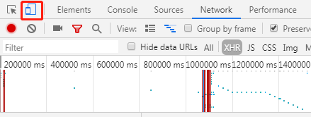
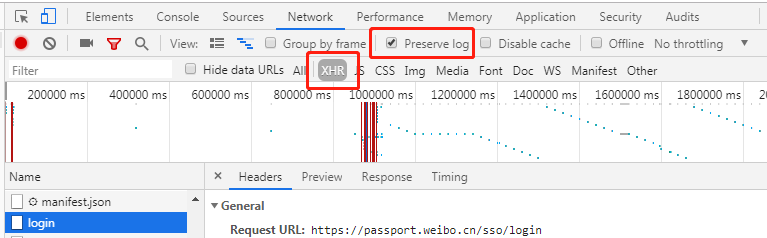
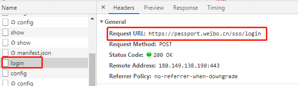
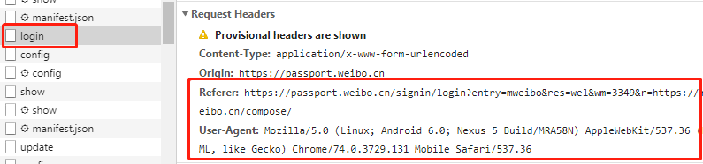
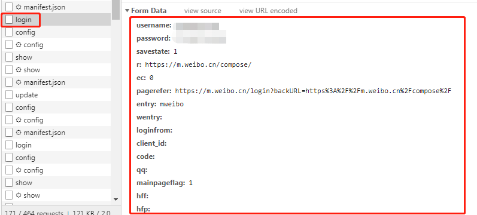

# 爬虫：登入新浪微博发表评论

## 微博登入

打开微博客户端：[https://m.weibo.cn/](https://m.weibo.cn/)，右击打开”检查“（有的浏览器叫”审查元素“）




点上图的小图标，可以切换网页版和手机版，手机版相对好爬一点

点击`Preserve log`，保留登入信息，接着输入账号密码登入。关注左侧`login`，这里面就是我们要爬取的信息。



### **获取登入网址**



```
URL_login = "https://passport.weibo.cn/sso/login"
```

### **获取头文件**



```python
headers = {
        'Referer': "https://passport.weibo.cn/signin/login?entry=mweibo&res=wel&wm=3349&r=https://m.weibo.cn/compose/",
        'User-Agent': "Mozilla/5.0 (Linux; Android 6.0; Nexus 5 Build/MRA58N) AppleWebKit/537.36 (KHTML, like Gecko) Chrome/74.0.3729.131 Mobile Safari/537.36"
        }
```

### **获取登入参数**



```python
params = {
        'username': '******',
        'password': '*******',
        'savestate': '1',
        'r': 'https://m.weibo.cn/compose/',
        'ec': '0',
        'pagerefer': 'https://m.weibo.cn/login?backURL=https%3A%2F%2Fm.weibo.cn%2Fcompose%2F',
        'entry': 'mweibo',
        'wentry': '',
        'loginfrom': '',
        'client_id': '',
        'code': '',
        'qq': '',
        'mainpageflag': '1',
        'hff': '',
        'hfp': ''
        }
```

### **登入微博**

```python
#  使用session保存登入状态
session = requests.Session()
session.headers.update(headers)
res = session.post(URL_login, data=params)
```

## 发表评论
```python
# 构造评论参数
data_compose = {
  'content': '本条微博由 Python 发送',
  'st': st
}
```
在`content`里面，输入你要发表的信息就可以啦~

## 完整代码

```python
import requests

# 登入微博网址
URL_login = "https://passport.weibo.cn/sso/login"

# 登入头文件
headers = {
        'Referer': "https://passport.weibo.cn/signin/login?entry=mweibo&res=wel&wm=3349&r=https://m.weibo.cn/compose/",
        'User-Agent': "Mozilla/5.0 (Linux; Android 6.0; Nexus 5 Build/MRA58N) AppleWebKit/537.36 (KHTML, like Gecko) Chrome/74.0.3729.131 Mobile Safari/537.36"
        }

# 登入参数
data_login = {
        'username': '*******',
        'password': '*******',
        'savestate': '1',
        'r': 'https://m.weibo.cn/compose/',
        'ec': '0',
        'pagerefer': 'https://m.weibo.cn/login?backURL=https%3A%2F%2Fm.weibo.cn%2Fcompose%2F',
        'entry': 'mweibo',
        'wentry': '',
        'loginfrom': '',
        'client_id': '',
        'code': '',
        'qq': '',
        'mainpageflag': '1',
        'hff': '',
        'hfp': ''
        }

#  使用session保存登入状态
session = requests.Session()
session.headers.update(headers)
req_login = session.post(URL_login, data=data_login)

# 评论网址
URL_comment = "https://m.weibo.cn/api/statuses/update"

# 获取st值
URL_st = "https://m.weibo.cn/api/config"
req_st = session.get(URL_st)
config = req_st.json()
st = config['data']['st']

# 构造评论参数
data_compose = {
  'content': '本条微博由 Python 发送',
  'st': st
}

# 实现评论功能
req_compose = session.post('https://m.weibo.cn/api/statuses/update', data=data_compose)
print(req_compose.status_code)
```

## 