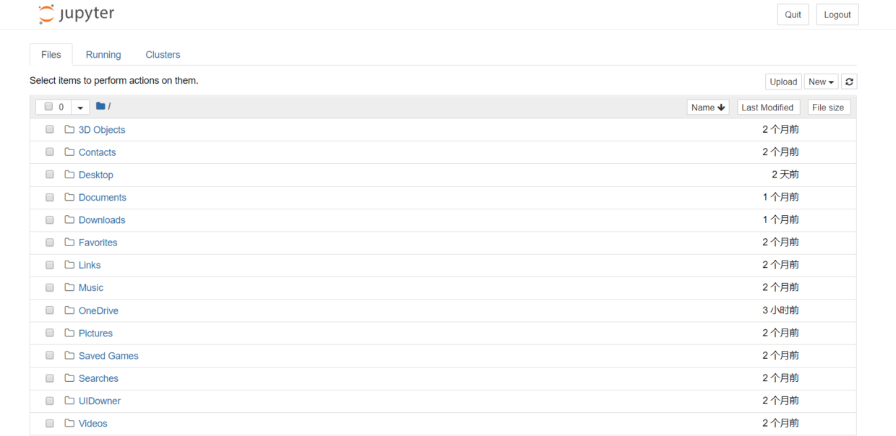
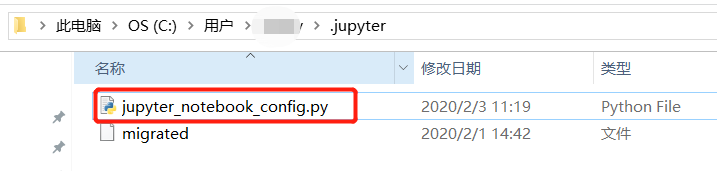
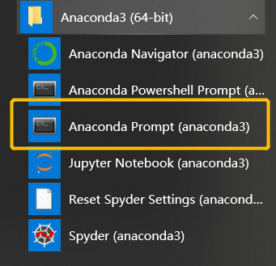
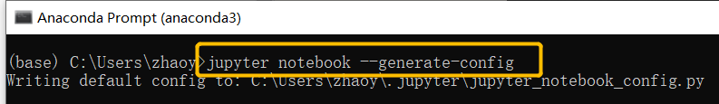
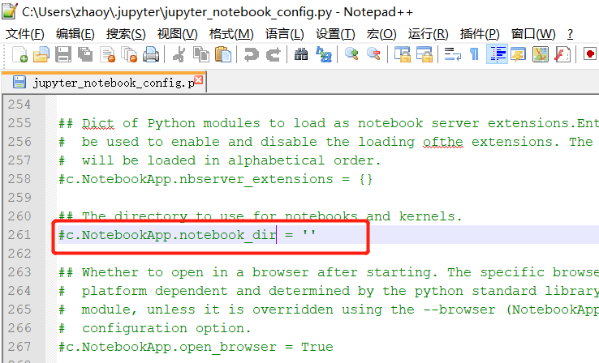

# jupyter notebook 更换路径

最近学习Python的时候，发现了 jupyter notebook 这个神器。初次使用，不会更改默认路径。查阅了一些资料，得以解决。

## 1、查找配置文件
首先找到你安装 jupyter 的文件路径，一般是在`C盘>用户>（你自己的用户名)>.jupyter`
你先看一下，有没有`Jupyter_notebook_config.py`这个文件。

如果有的话，直接跳过下一步，进入步骤3，更改路径
如果没有的话，请看下一步

## 2、生成jupyter notebook 配置文件

如果你发现，你没有`Jupyter_notebook_config.py`这个文件，那你需要先生成一个

打开`Anaconda Prompt`

输入`jupyter notebook --generate-config`

然后你就可以在文件夹中看到这个文件了

## 3、修改路径

打开`Jupyter_notebook_config.py`文件，找到`#c.NotebookApp.notebook_dir = ' '`，改为`c.NotebookApp.notebook_dir = '你自己要的路径'`，注意，把 `#` 去掉

比如我想把默认路径改到D盘，我就改为
~~#c.NotebookApp.notebook_dir = ' '~~
c.NotebookApp.notebook_dir = 'D:\\Python'

然后保存文件

这时候，输入`jupyter notebook`就可以启动了

路径更改成功~

## 参考文章
1、[jupyter notebook 改变工作路径](https://blog.csdn.net/xiaozisheng2008_/article/details/80300485)
2、[jupyter更换路径](https://www.jianshu.com/p/c68333956f5a)，作者：aaa小菜鸡