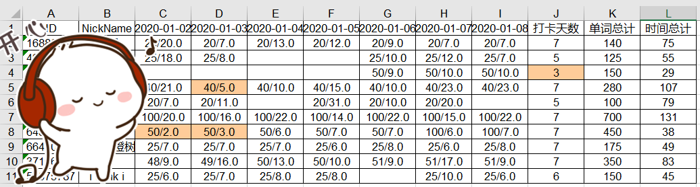
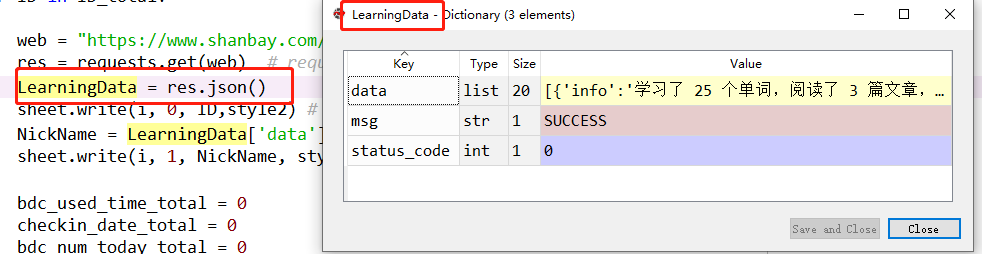
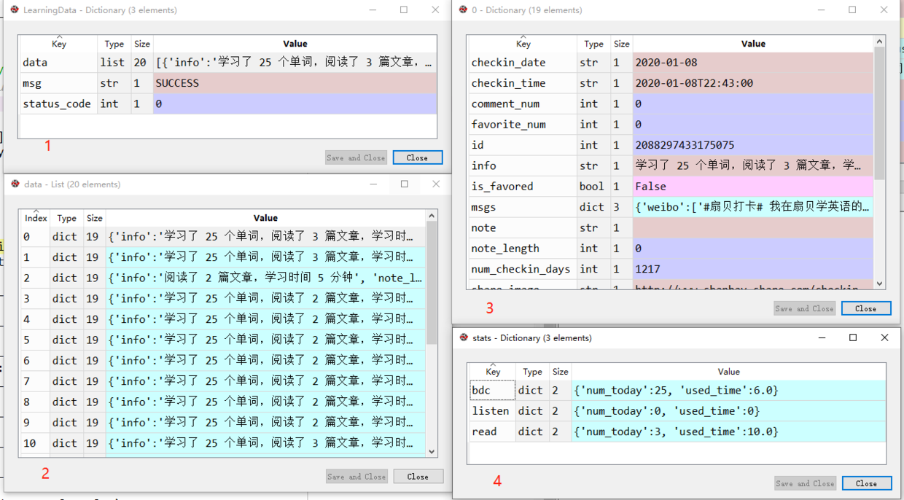

# Python爬虫：统计扇贝单词打卡记录

这个工作基于，我们自发成立了一个背单词的微信群，大家都在扇贝APP上背单词。每周需要统计，微信群里哪些同学没有按时背单词，那这些同学，就会被扣一点小钱，变成红包发给群里其他按时背单词的小伙伴。

我在去年写过一篇[统计扇贝网站打卡数据](Python/12.md)
其中完成了下面几个功能：
1、从txt导入已知的扇贝ID
2、根据扇贝ID，用`urllib`模块，从扇贝网获取小组成员打卡信息
3、利用`re`正则化匹配，把和单词相关数据匹配出来
4、将结果保存到Excel（无格式）

本篇在以上基础上，做一些改进
1、从txt导入已知的扇贝ID
~~2、根据扇贝ID，，用`urllib`模块，从扇贝网获取小组成员打卡信息~~
2、根据扇贝ID，，用`requests`模块，从扇贝网获取小组成员打卡信息
~~3、利用`re`正则化匹配，把和单词相关数据匹配出来~~
3、利用`json()`方法，直接获取数据
~~4、将结果保存到Excel（无格式）~~
4、将一周的单词，根据日期，保存到Excel，添加格式

格式如下：
1、每天背单词<20个的，标黄
2、每天背单词<6分钟的，标黄
3、一周背单词<5天的，标黄

效果图如下，我把ID和昵称挡了挡~


# 开始写代码
导入相关的库
```python
import datetime # 计算时间
import xlwt # 保存Excel
import os # 获取文件路劲
import requests  # 获取网页数据
```
计算打卡的统计时间，默认是查过去7天的。我一般是周一查卡，过去7天就刚好一周。
```python
DayToday = str(datetime.datetime.now()).split(" ")[0]
# now = datetime.date(2019,9,9)      # 输入查卡日期，自定义查卡日期
print("查卡日期：",DayToday)
print('\n')
DayMon = str(datetime.datetime.now() - datetime.timedelta(days=7)).split(" ")[0]  
DayTue = str(datetime.datetime.now() - datetime.timedelta(days=6)).split(" ")[0]  
DayWed = str(datetime.datetime.now() - datetime.timedelta(days=5)).split(" ")[0]  
DayThur = str(datetime.datetime.now() - datetime.timedelta(days=4)).split(" ")[0]  
DayFri = str(datetime.datetime.now() - datetime.timedelta(days=3)).split(" ")[0]  
DaySat = str(datetime.datetime.now() - datetime.timedelta(days=2)).split(" ")[0] 
DaySun = str(datetime.datetime.now() - datetime.timedelta(days=1)).split(" ")[0]  
DayEnd = str(datetime.datetime.now() - datetime.timedelta(days=8)).split(" ")[0]  
```
准备Excel
```python
workbook = xlwt.Workbook()  #定义workbook
sheet = workbook.add_sheet(DayToday)  #添加sheet
```
创建两种单元格样式
1、普通单元格：上下左右居中、黑色边框
2、特殊单元格：上下左右居中、黑色边框、彩色底纹
关于Excel的设置，可参考[利用xlwt设置Excel单元格格式](Python/2.md)，内有详细设置说明

```python
# 设置居中
al = xlwt.Alignment()
al.horz = 0x02      # 设置水平居中
al.vert = 0x01      # 设置垂直居中

# 设置边框
borders = xlwt.Borders() # Create Borders
borders.left = xlwt.Borders.THIN 
borders.right = xlwt.Borders.THIN
borders.top = xlwt.Borders.THIN
borders.bottom = xlwt.Borders.THIN
borders.left_colour = 0x40
borders.right_colour = 0x40
borders.top_colour = 0x40
borders.bottom_colour = 0x40

# 设置单元格背景颜色
pattern = xlwt.Pattern() 
pattern.pattern = xlwt.Pattern.SOLID_PATTERN 
pattern.pattern_fore_colour = 47

# 创建样式
style1 = xlwt.XFStyle()  # 创建一个样式对象，初始化样式 style1
style2 = xlwt.XFStyle()  # 创建一个样式对象，初始化样式 style2

style1.borders = borders 
style2.borders = borders 
style1.alignment = al
style2.alignment = al
style1.pattern = pattern 
```
写入Excel表头数据
```python
head = ['ID', 'NickName', DayMon, DayTue, DayWed, DayThur, DayFri, DaySat, DaySun,'打卡天数','单词总计', '时间总计']    #表头
for h in range(len(head)):
    sheet.write(0, h, head[h],style2)    #把表头写到Excel里面去
i = 1  #定义Excel表格的行数，从第二行开始写入，第一行已经写了表头
```
从txt文件导入小组的扇贝ID，根据回车符换行
```python
ID_total_input = open('ID.txt')
ID_total = ID_total_input.read()
ID_total = ID_total.split("\n")  # 如果输入多个ID，用“\n”分开
```
上一个`for`循环，依次读取ID，添加到网址。
```python
for ID in ID_total:
    
    web = "https://www.shanbay.com/api/v1/checkin/user/"+str(ID)+"/"
    res = requests.get(web)  # requests发起请求，静态网页用get
    LearningData = res.json()
    sheet.write(i, 0, ID,style2) # 保存ID
    NickName = LearningData['data'][0]['user']['nickname']
    sheet.write(i, 1, NickName, style2) # 保存昵称

    bdc_used_time_total = 0
    checkin_date_total = 0
    bdc_num_today_total = 0
    # 获取单词打卡记录
    for LearningDataDaily in LearningData['data']:
        checkin_date =  LearningDataDaily['checkin_date']
        if checkin_date == DayMon:
            CollectCheakinBDC(i,2,LearningDataDaily,style1,style2)
        if checkin_date == DayTue:
            CollectCheakinBDC(i,3,LearningDataDaily,style1,style2)
        if checkin_date == DayWed:
            CollectCheakinBDC(i,4,LearningDataDaily,style1,style2)
        if checkin_date == DayThur:
            CollectCheakinBDC(i,5,LearningDataDaily,style1,style2)         
        if checkin_date == DayFri:
            CollectCheakinBDC(i,6,LearningDataDaily,style1,style2)
        if checkin_date == DaySat:
            CollectCheakinBDC(i,7,LearningDataDaily,style1,style2)
        if checkin_date == DaySun:
            CollectCheakinBDC(i,8,LearningDataDaily,style1,style2)
    if checkin_date_total<5:
        sheet.write(i, 9, checkin_date_total,style1)
    else:
        sheet.write(i, 9, checkin_date_total,style2)
    sheet.write(i, 10, bdc_num_today_total,style2)
    sheet.write(i, 11, bdc_used_time_total,style2)
    print(ID+","+NickName+"打卡"+str(checkin_date_total)+"天，单词总计"+str(bdc_num_today_total)+"个")
    i += 1 
```
如果大家有印象的话，之前我们是解析网址之后，用`re`正则化匹配，把数据匹配出来的。例如这样，一层一层地把数据匹配出来
```python
re.findall("\"stats\".*?track_object_img" ,shanbay_data)
find_data = re.findall("\"stats\".*?track_object_img" ,shanbay_data)
bdc = re.findall("\"bdc\":.*?}",data)
if bdc == []:
     bdc = "{num_today\": 0, \"used_time\": 0.0}"    
```
其实你还是可以这么做，就是比较麻烦。这里我们改用`res.json()`



我们看一下`LearningData`的数据



如果我们想要单词`bdc`的数据，我们不需要各种匹配来匹配去的了（还容易出错），我们直接`LearningData['data'][0]['stats']['bdc']['num_today']`就完事了。如果你还想要别的数据，也一样很容易获取。

定义一个函数，把单词打卡数据写入Excel，匹配相对应的格式
```python
def CollectCheakinBDC(i,day,LearningDataDaily,style1,style2):
    global bdc_used_time_total,bdc_num_today_total,checkin_date_total
    try:
        bdc_num_today = LearningDataDaily['stats']['bdc']['num_today']
        bdc_used_time = LearningDataDaily['stats']['bdc']['used_time']
        if bdc_num_today<20 or bdc_used_time<6:
            sheet.write(i, day, str(bdc_num_today)+"/"+str(bdc_used_time),style1)
        else:
            sheet.write(i, day, str(bdc_num_today)+"/"+str(bdc_used_time),style2)
        bdc_used_time_total += bdc_used_time
        bdc_num_today_total += bdc_num_today
        checkin_date_total += 1
    except:  
        bdc_num_today = 0
        bdc_used_time = 0.0
        bdc_used_time_total = bdc_used_time_total
        bdc_num_today_total = bdc_num_today_total
        checkin_date_total = checkin_date_total
    return bdc_used_time_total,bdc_num_today_total,checkin_date_total
```
最后把Excel保存一下
```python
workbook.save('C:/Users/admin/Desktop/单词群打卡.xls')
```
# 完整代码

其实这个代码，还存在一些问题
- 有点冗长，应该有更好的方法，可以把单元格和日期匹配起来，而不是用7个if...
-  如果这一天这位同学没有背单词，就不会有数据，没办法设置单元格格式，没法加边框
- 没办法自动设置列宽，只能给列宽设置一个统一的值

后续再继续优化，今天就到这啦~
```python
# -*- coding: utf-8 -*-
"""
Created on Mon May 20 11:50:05 2019

@author: Yenny
"""


import datetime # 计算时间
import xlwt # 保存Excel
import os # 获取文件路劲
import requests  # 获取网页数据

#计算打卡的统计时间
DayToday = str(datetime.datetime.now()).split(" ")[0]
# now = datetime.date(2019,9,9)      # 输入查卡日期，自定义查卡日期
print("查卡日期：",DayToday)
print('\n')
DayMon = str(datetime.datetime.now() - datetime.timedelta(days=7)).split(" ")[0]  
DayTue = str(datetime.datetime.now() - datetime.timedelta(days=6)).split(" ")[0]  
DayWed = str(datetime.datetime.now() - datetime.timedelta(days=5)).split(" ")[0]  
DayThur = str(datetime.datetime.now() - datetime.timedelta(days=4)).split(" ")[0]  
DayFri = str(datetime.datetime.now() - datetime.timedelta(days=3)).split(" ")[0]  
DaySat = str(datetime.datetime.now() - datetime.timedelta(days=2)).split(" ")[0] 
DaySun = str(datetime.datetime.now() - datetime.timedelta(days=1)).split(" ")[0]  
DayEnd = str(datetime.datetime.now() - datetime.timedelta(days=8)).split(" ")[0]  

# 定义保存Excel的位置
workbook = xlwt.Workbook()  #定义workbook
sheet = workbook.add_sheet(DayToday)  #添加sheet

# 设置居中
al = xlwt.Alignment()
al.horz = 0x02      # 设置水平居中
al.vert = 0x01      # 设置垂直居中

# 设置边框
borders = xlwt.Borders() # Create Borders
borders.left = xlwt.Borders.THIN 
borders.right = xlwt.Borders.THIN
borders.top = xlwt.Borders.THIN
borders.bottom = xlwt.Borders.THIN
borders.left_colour = 0x40
borders.right_colour = 0x40
borders.top_colour = 0x40
borders.bottom_colour = 0x40

# 设置单元格背景颜色
pattern = xlwt.Pattern() 
pattern.pattern = xlwt.Pattern.SOLID_PATTERN 
pattern.pattern_fore_colour = 47


# 创建样式
style1 = xlwt.XFStyle()  # 创建一个样式对象，初始化样式 style1
style2 = xlwt.XFStyle()  # 创建一个样式对象，初始化样式 style2

style1.borders = borders # Add Borders to Style
style2.borders = borders # Add Borders to Style
style1.alignment = al
style2.alignment = al
style1.pattern = pattern # Add Pattern to Style

# 写入数据
head = ['ID', 'NickName', DayMon, DayTue, DayWed, DayThur, DayFri, DaySat, DaySun,'打卡天数','单词总计', '时间总计']    #表头
for h in range(len(head)):
    sheet.write(0, h, head[h],style2)    #把表头写到Excel里面去

    
path = os.getcwd() # 获取当前代码文件路径
print("开始读取ID数据")
print("数据位置："+ path+"ID.txt")
print('\n')

#从txt导入数据
ID_total_input = open('ID.txt')
ID_total = ID_total_input.read()
ID_total = ID_total.split("\n")  # 如果输入多个ID，用“\n”分开

i = 1  #定义Excel表格的行数，从第二行开始写入，第一行已经写了表头

def CollectCheakinBDC(i,day,LearningDataDaily,style1,style2):
    global bdc_used_time_total,bdc_num_today_total,checkin_date_total
    try:
        bdc_num_today = LearningDataDaily['stats']['bdc']['num_today']
        bdc_used_time = LearningDataDaily['stats']['bdc']['used_time']
        if bdc_num_today<20 or bdc_used_time<6:
            sheet.write(i, day, str(bdc_num_today)+"/"+str(bdc_used_time),style1)
        else:
            sheet.write(i, day, str(bdc_num_today)+"/"+str(bdc_used_time),style2)
        bdc_used_time_total += bdc_used_time
        bdc_num_today_total += bdc_num_today
        checkin_date_total += 1
    except:  
        bdc_num_today = 0
        bdc_used_time = 0.0
        bdc_used_time_total = bdc_used_time_total
        bdc_num_today_total = bdc_num_today_total
        checkin_date_total = checkin_date_total
    return bdc_used_time_total,bdc_num_today_total,checkin_date_total

for ID in ID_total:
    
    web = "https://www.shanbay.com/api/v1/checkin/user/"+str(ID)+"/"
    res = requests.get(web)  # requests发起请求，静态网页用get
    LearningData = res.json()
    sheet.write(i, 0, ID,style2) # 保存ID
    NickName = LearningData['data'][0]['user']['nickname']
    sheet.write(i, 1, NickName, style2) # 保存昵称

    bdc_used_time_total = 0
    checkin_date_total = 0
    bdc_num_today_total = 0
    # 获取单词打卡记录
    for LearningDataDaily in LearningData['data']:
        checkin_date =  LearningDataDaily['checkin_date']
        if checkin_date == DayMon:
            CollectCheakinBDC(i,2,LearningDataDaily,style1,style2)
        if checkin_date == DayTue:
            CollectCheakinBDC(i,3,LearningDataDaily,style1,style2)
        if checkin_date == DayWed:
            CollectCheakinBDC(i,4,LearningDataDaily,style1,style2)
        if checkin_date == DayThur:
            CollectCheakinBDC(i,5,LearningDataDaily,style1,style2)         
        if checkin_date == DayFri:
            CollectCheakinBDC(i,6,LearningDataDaily,style1,style2)
        if checkin_date == DaySat:
            CollectCheakinBDC(i,7,LearningDataDaily,style1,style2)
        if checkin_date == DaySun:
            CollectCheakinBDC(i,8,LearningDataDaily,style1,style2)
    if checkin_date_total<5:
        sheet.write(i, 9, checkin_date_total,style1)
    else:
        sheet.write(i, 9, checkin_date_total,style2)
    sheet.write(i, 10, bdc_num_today_total,style2)
    sheet.write(i, 11, bdc_used_time_total,style2)
    print(ID+","+NickName+"打卡"+str(checkin_date_total)+"天，单词总计"+str(bdc_num_today_total)+"个")
    i += 1 

workbook.save('C:/Users/admin/Desktop/单词群打卡.xls')
print('\n') 
print('写入excel成功')
print("文件位置：")
print("C:/Users/Administrator/Desktop/单词群打卡.xls")
print('\n') 
input("查卡完毕，点击回车退出")  
```