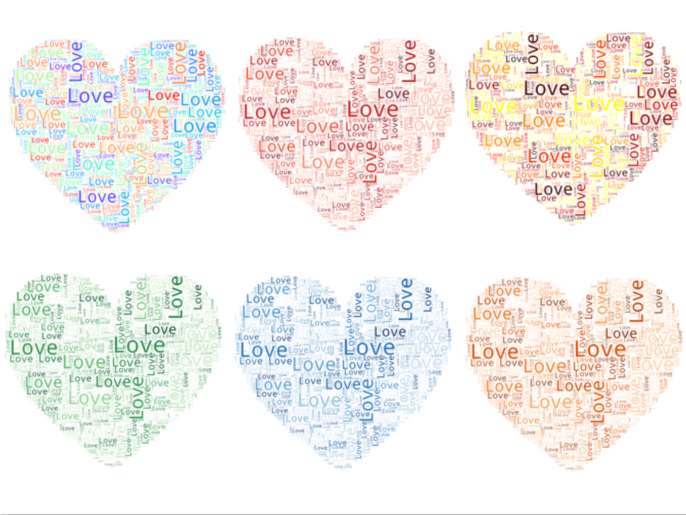

# 用WordCloud画个爱心

七夕了，给大家画个爱心


## WordCloud详细介绍
[Python数据可视化：WordCloud入门](Python/9.md)
[Python数据可视化：WordCloud+GUI](Python/8.md)

## 爱心代码
```python
# -*- coding: utf-8 -*-
"""
Created on Tue Aug  6 2019
@author: YangZ
"""

from os import path
from PIL import Image
import numpy as np
import matplotlib.pyplot as plt
import os

from wordcloud import WordCloud

# 获取当前文件路径
d = path.dirname(__file__) if "__file__" in locals() else os.getcwd()


text = "Love"   # 输入文字

# 从网上找了一个爱心的图片，获取图片轮廓
love_coloring = np.array(Image.open(path.join(d, "love1.jpg")))

# 设置词云参数
wc = WordCloud(
               background_color = "white",  #背景是白色
               repeat = True, # 单词可以重复               
               mask = love_coloring,  # 设置轮廓
               max_font_size = 100, # 最大字号
               random_state = 42,
               max_words = 1000, # 最多词个数
               colormap = "Reds" # 选择色系
              )

# 从文本生成wordcloud
wc.generate(text)

# 根据图片，创建颜色（也可以用这个方式）
#image_colors = ImageColorGenerator(love_coloring)

# 绘制图片
plt.figure()    
plt.imshow(wc, interpolation="bilinear")
# plt.imshow(wc.recolor(color_func=image_colors), interpolation="bilinear")
plt.axis("off")

# 保存到文件
wc.to_file(path.join(d, "love.png"))
    
plt.show()
```


## 颜色修改
本文用的是大红色，颜色可以修改



> Possible values are:
>
>  Accent, Accent_r, Blues, Blues_r, BrBG, BrBG_r, BuGn, BuGn_r, BuPu, BuPu_r, CMRmap, CMRmap_r, Dark2, Dark2_r, GnBu, GnBu_r, Greens, Greens_r, Greys, Greys_r, OrRd, OrRd_r, Oranges, Oranges_r, PRGn, PRGn_r, Paired, Paired_r, Pastel1, Pastel1_r, Pastel2, Pastel2_r, PiYG, PiYG_r, PuBu, PuBuGn, PuBuGn_r, PuBu_r, PuOr, PuOr_r, PuRd, PuRd_r, Purples, Purples_r, RdBu, RdBu_r, RdGy, RdGy_r, RdPu, RdPu_r, RdYlBu, RdYlBu_r, RdYlGn, RdYlGn_r, Reds, Reds_r, Set1, Set1_r, Set2, Set2_r, Set3, Set3_r, Spectral, Spectral_r, Wistia, Wistia_r, YlGn, YlGnBu, YlGnBu_r, YlGn_r, YlOrBr, YlOrBr_r, YlOrRd, YlOrRd_r, afmhot, afmhot_r, autumn, autumn_r, binary, binary_r, bone, bone_r, brg, brg_r, bwr, bwr_r, cividis, cividis_r, cool, cool_r, coolwarm, coolwarm_r, copper, copper_r, cubehelix, cubehelix_r, flag, flag_r, gist_earth, gist_earth_r, gist_gray, gist_gray_r, gist_heat, gist_heat_r, gist_ncar, gist_ncar_r, gist_rainbow, gist_rainbow_r, gist_stern, gist_stern_r, gist_yarg, gist_yarg_r, gnuplot, gnuplot2, gnuplot2_r, gnuplot_r, gray, gray_r, hot, hot_r, hsv, hsv_r, inferno, inferno_r, jet, jet_r, magma, magma_r, nipy_spectral, nipy_spectral_r, ocean, ocean_r, pink, pink_r, plasma, plasma_r, prism, prism_r, rainbow, rainbow_r, seismic, seismic_r, spring, spring_r, summer, summer_r, tab10, tab10_r, tab20, tab20_r, tab20b, tab20b_r, tab20c, tab20c_r, terrain, terrain_r, twilight, twilight_r, twilight_shifted, twilight_shifted_r, viridis, viridis_r, winter, winter_r