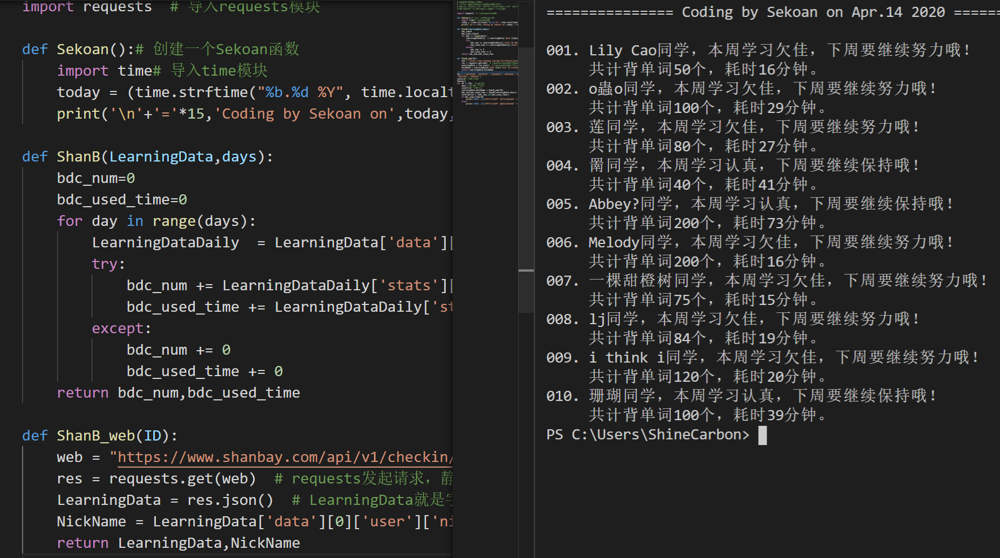

# 课程目录

周一至周五学习，周末休息+自我实践，可以随意提问

## [第一周 基础](Python/basic.md)

1. Python安装和运行（画个小猪佩奇）
2. 入门语句：输入、输出、注释、基本运算符（基本运算操作）
3. 字符串（清洗豆瓣数据）
4. 列表 
5. 循环+元组（输出豆瓣排行榜）
6. 休息日
7. 实践日：输出[豆瓣电影 Top 250](https://movie.douban.com/top250)，前25部电影详情

## [第二周 基础进阶](Python/basic.md)

1. 字典（清洗扇贝打卡数据）
2. 条件判断IF
3. 函数
4. 模块
5. 梳理一下基础部分所有内容，缓一缓
6. 休息+问答日
7. 休息+问答日

## 第三周 爬虫基础

1. [爬虫+网页介绍（修改你偶像的微博状态）](Python/13.md)
2. [爬虫豆瓣读书排行榜（单页）](Python/31.md)
3. [爬虫豆瓣读书排行榜（翻页+保存数据）](Python/31.md)
4. [下载网易云/QQ音乐评论](Python/18.md)
5. [模拟登入新浪微博，发表评论和点赞](Python/20.md)
6. 休息+问答日
7. 实践日：[统计扇贝单词打卡记录](Python/27.md)

## 第四周 爬虫进阶

1. [模拟浏览器自动化，爬取知网的数据](Python/4.md)
2. 上述课程略复杂，再多上1日
3. [Scrapy框架：爬取知乎回答](Python/32.md)
4. 上述课程略复杂，再多上1日
5. 上述课程略复杂，再多上1日
6. 休息+问答日
7. 实践日：做一个自己的小爬虫

## 第五周 一些好玩的小程序

是不正经的编外内容

1. [用myqr构建二维码](Python/15.md)
2. [用aiml构建英语聊天机器人](Python/1.md)
3. [批量抠图](Python/30.md)
4. [图形界面入门，制作一个日历](Python/28.md)
5. [Tkinter入门：制作学习进度图](Python/29.md)
6. 休息+问答日
7. 实践日：制作学习进度图

## 第六周 数据可视化

1. [用WordCloud制作图云](Python/9.md)
2. [GUI+WordCloud](https://mp.weixin.qq.com/s/89JVrdwFsUSt1WggrDqmcw) / [WordCloud画个爱心](https://mp.weixin.qq.com/s/dSosPb22pqbKiVfp4khAwg)（基础好的选前一个，基础弱的选后一个）
3. [Python数据可视化：pygal](https://mp.weixin.qq.com/s/S0DUfk0E2wArACnXmc7oKg)
4. [下拉菜单和数据透视构建记账本](https://mp.weixin.qq.com/s/V4RMUVuIkZCWeFnrKpDICA)
5. [用Pygal统计家庭支出情况](https://mp.weixin.qq.com/s/TyWwevZgrixLCHbs6FwwmA)
6. 休息+问答日
7. 实践日：自己做一个可视化图表

# 作业情况

## 基础课

|                | 1    | 2    | 3    | 4    | 5    | 6    | 7    | 8    | 9    |
| -------------- | ---- | ---- | ---- | ---- | ---- | ---- | ---- | ---- | ---- |
| 冬冬           | ✔    | ✔    | ✔    | ✔    | ✔    | ✔    | ✔    | ✔    | ✔    |
| Joyce          | ✔    | ✔    | ✔    | ✔    | ✔    | ✔    | ✔    | ✔    | ✔    |
| Sunshine       | ✔    | ✔    | ✔    | ✔    | ✔    | ✔    | ✔    | ✔    | ✔    |
| Clover         | ✔    |      |      |      |      |      |      |      |      |
| Billy          | ✔    | ✔    | ✔    | ✔    | ✔    |      |      |      |      |
| 万巧书         |      | ✔    | ✔    | ✔    | ✔    | ✔    | ✔    | ✔    | ✔    |
| 亮             | ✔    | ✔    | ✔    | ✔    | ✔    | ✔    | ✔    | ✔    | ✔    |
| 鲍鲍鲍鲍       | ✔    | ✔    | ✔    | ✔    | ✔    | ✔    | ✔    | ✔    |      |
| 既明且哲       | ✔    | ✔    | ✔    | ✔    | ✔    |      |      |      |      |
| 小冷           | ✔    | ✔    | ✔    | ✔    | ✔    | ✔    | ✔    | ✔    | ✔    |
| Sekoan         | ✔    | ✔    | ✔    | ✔    | ✔    | ✔    | ✔    | ✔    | ✔    |
| 莲             | ✔    | ✔    | ✔    | ✔    | ✔    | ✔    | ✔    | ✔    |      |
| biu biu        | ✔    | ✔    | ✔    |      |      |      |      |      |      |
| Emma           | ✔    | ✔    | ✔    | ✔    | ✔    |      |      |      |      |
| EMily霞        | ✔    | ✔    | ✔    | ✔    |      |      |      |      |      |
| 时时蓝         |      |      |      |      |      |      |      |      |      |
| york_yang      |      |      |      |      |      |      |      |      |      |
| 甜橙树         | ✔    | ✔    | ✔    | ✔    | ✔    | ✔    | ✔    | ✔    |      |
| 夏冰           | ✔    | ✔    | ✔    | ✔    |      |      |      |      |      |
| Abbey          | ✔    | ✔    | ✔    | ✔    | ✔    | ✔    | ✔    | ✔    | ✔    |
| Homonidae      | ✔    | ✔    | ✔    | ✔    | ✔    | ✔    | ✔    | ✔    | ✔    |
| xi             | ✔    | ✔    | ✔    | ✔    | ✔    | ✔    | ✔    | ✔    | ✔    |
| 归0            |      |      |      |      |      |      |      |      |      |
| Benche         | ✔    | ✔    | ✔    | ✔    | ✔    | ✔    | ✔    | ✔    | ✔    |
| LZS            |      |      |      |      |      |      |      |      |      |
| 胖虎           | ✔    | ✔    | ✔    | ✔    | ✔    | ✔    | ✔    | ✔    | ✔    |
| Jupiter        |      |      |      |      |      |      |      |      |      |
| Wendy          | ✔    | ✔    | ✔    | ✔    | ✔    | ✔    |      |      |      |
| 王徒思蕊       |      |      |      |      |      |      |      |      |      |
| 笑我飘零       |      |      |      |      |      |      |      |      |      |
| smile  forever | ✔    |      |      |      |      |      |      |      |      |
| Ivy Tang       | ✔    | ✔    | ✔    | ✔    | ✔    | ✔    | ✔    | ✔    | ✔    |
| 鎏饭饭         | ✔    | ✔    | ✔    | ✔    | ✔    | ✔    | ✔    | ✔    | ✔    |
| 仁千           |      | ✔    | ✔    | ✔    | ✔    | ✔    |      |      |      |
| 文             |      |      |      |      |      |      |      |      |      |

## 爬虫

|                | 网页 | 豆瓣 | 音乐 | 微博 | 扇贝 | 知网 |
| -------------- | ---- | ---- | ---- | ---- | ---- | ---- |
| 冬冬           | ✔    | ✔    |      |      |      |      |
| Joyce          | ✔    | ✔    |      |      |      |      |
| Sunshine       | ✔    | ✔    | ✔    |      |      |      |
| Clover         |      |      |      |      |      |      |
| Billy          |      |      |      |      |      |      |
| 万巧书         | ✔    | ✔    |      |      |      |      |
| 亮             |      |      |      |      |      |      |
| 鲍鲍鲍鲍       |      |      |      |      |      |      |
| 既明且哲       |      |      |      |      |      |      |
| 小冷           | ✔    | ✔    | ✔    |      |      |      |
| Sekoan         | ✔    | ✔    | ✔    | ✔    | ✔    | ✔    |
| 莲             | ✔    | ✔    |      |      |      |      |
| biu biu        |      |      |      |      |      |      |
| Emma           |      |      |      |      |      |      |
| EMily霞        |      |      |      |      |      |      |
| 时时蓝         |      |      |      |      |      |      |
| york_yang      |      |      |      |      |      |      |
| 甜橙树         | ✔    | ✔    | ✔    |      |      |      |
| 夏冰           |      |      |      |      |      |      |
| Abbey          |      |      |      |      |      |      |
| Homonidae      | ✔    |      |      |      |      |      |
| xi             | ✔    | ✔    | ✔    |      |      |      |
| 归0            |      |      |      |      |      |      |
| Benche         | ✔    | ✔    |      |      |      |      |
| LZS            |      |      |      |      |      |      |
| 胖虎           | ✔    | ✔    |      |      |      |      |
| Jupiter        |      |      |      |      |      |      |
| Wendy          |      |      |      |      |      |      |
| 王徒思蕊       |      |      |      |      |      |      |
| 笑我飘零       |      |      |      |      |      |      |
| smile  forever |      |      |      |      |      |      |
| Ivy Tang       |      |      |      |      |      |      |
| 鎏饭饭         |      |      |      |      |      |      |
| 仁千           |      |      |      |      |      |      |
| 文             |      |      |      |      |      |      |

# 作业展示

## 1 画一个小猪佩奇

## 2 入门语句

## 3 字符串操作

## 4 列表

## 5 循环

## 6 字典

## 7 if判断

## 8 函数

## 9 模块

## 10 网页

## 10-11 豆瓣

