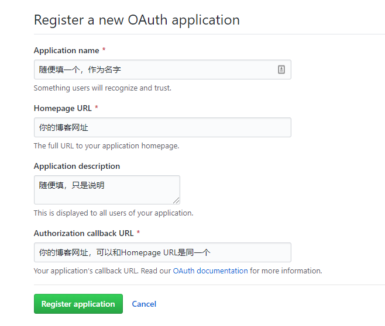
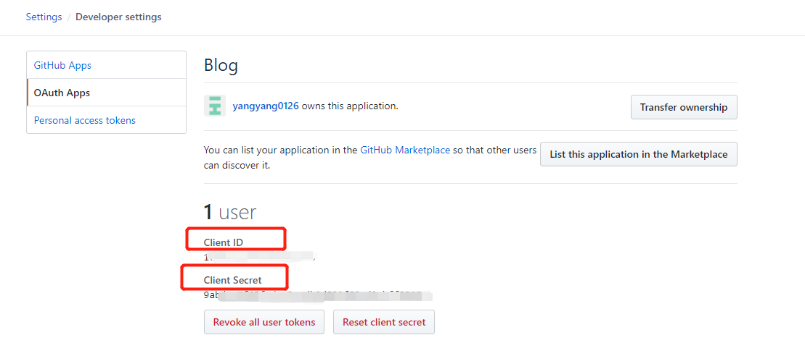
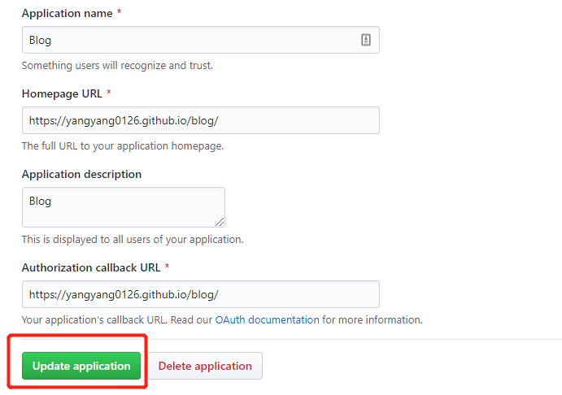
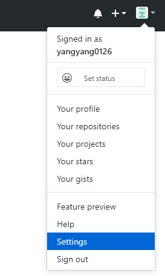
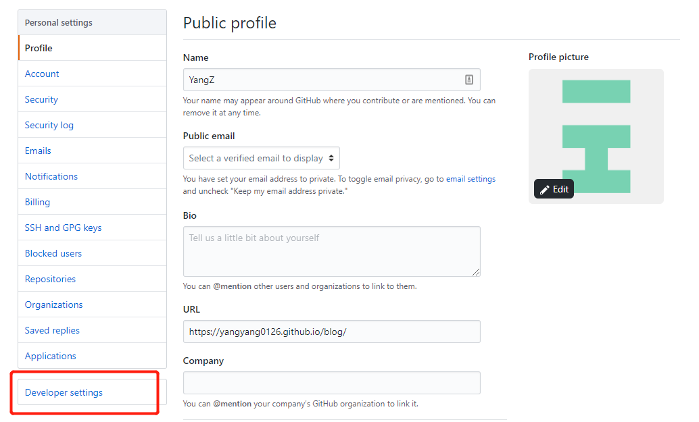
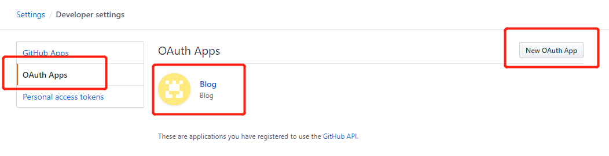
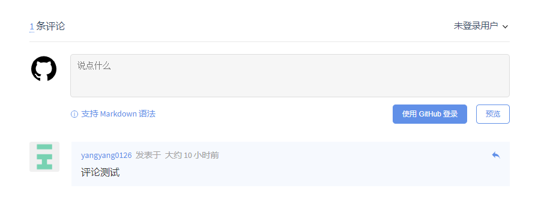

# docsify：设置Gitalk评论系统

## 写在前面的话

[Gitalk](https://github.com/gitalk/gitalk)，一个现代化的，基于Preact和Github Issue的评论系统。[docsify官网](https://docsify.js.org/#/zh-cn/plugins)中给出的示例是这样的
```html
<link rel="stylesheet" href="//unpkg.com/gitalk/dist/gitalk.css">

<script src="//unpkg.com/docsify/lib/plugins/gitalk.min.js"></script>
<script src="//unpkg.com/gitalk/dist/gitalk.min.js"></script>
<script>
  const gitalk = new Gitalk({
    clientID: 'Github Application Client ID',
    clientSecret: 'Github Application Client Secret',
    repo: 'Github repo',
    owner: 'Github repo owner',
    admin: ['Github repo collaborators, only these guys can initialize github issues'],
    // facebook-like distraction free mode
    distractionFreeMode: false
  })
</script>
```
我们发现，这里面有五个信息，是需要我们填写的
```html
    clientID: 'Github Application Client ID',
    clientSecret: 'Github Application Client Secret',
    repo: 'Github repo',
    owner: 'Github repo owner',
    admin: ['Github repo collaborators, only these guys can initialize github issues'],
```
其中
`repo`：填写你要保存评论的**仓库名字**
`owner`：就是你的Github名字
`admin`：就是你的Github名字。如果你希望别人和你一起管理，你也可以写在这里
另外还有`clientID`和`clientSecret`，这个我们得先去GitHub上申请，然后才能有。

## 申请Gitalk
申请网址：https://github.com/settings/applications/new
要是觉得自己填的不好或者填错了，没关系，这个后面是可以改的



注册完毕之后，会进入这个界面



在这里，你就能看到`clientID`和`clientSecret`啦。把页面往下翻，能看到你刚刚填写得信息。



如果你觉得不对，你可以重新填写，然后点击`Update application`，更新一下。

这里顺带提一下，平时我们怎么打开这个页面。进入你的GitHub主页，右上角点击`Settings`



点击`Developer settings`，进入APP界面



点击`OAuth Apps`，如果你申请好了，就会在这里看到。同样你也可以在右小角点击`New OAuth App`新建，和刚刚https://github.com/settings/applications/new的效果是一样的



## 修改index文件

现在我们就来改代码
```html
<link rel="stylesheet" href="//unpkg.com/gitalk/dist/gitalk.css">

<script src="//unpkg.com/docsify/lib/plugins/gitalk.min.js"></script>
<script src="//unpkg.com/gitalk/dist/gitalk.min.js"></script>
<script>
  const gitalk = new Gitalk({
    clientID: '刚刚申请下来的ID',
    clientSecret: '刚刚申请下来的密码',
    repo:'仓库名字，用于保存你博客评论的仓库，可以和你的博客是一个仓库',
    owner:你的Github名字,
    admin: ['你的Github名字和其他管理员的名字'],
    // facebook-like distraction free mode
    distractionFreeMode: false
  })
</script>
```
打开`index.html`文件，把`<link rel="stylesheet" href="//unpkg.com/gitalk/dist/gitalk.css">`，这行代码，添加到`<head>...</head>`中
```html
<head>
  <meta charset="UTF-8">
  <title>Document</title>
  <meta http-equiv="X-UA-Compatible" content="IE=edge,chrome=1" />
  <meta name="description" content="Description">
  <meta name="viewport" content="width=device-width, user-scalable=no, initial-scale=1.0, maximum-scale=1.0, minimum-scale=1.0">
  <link rel="stylesheet" href="//unpkg.com/docsify/lib/themes/vue.css">
  <link rel="stylesheet" href="//unpkg.com/gitalk/dist/gitalk.css">  
</head>
```

然后把其他代码，插入到`<body>...</body>`中
```html
<body>
  <div id="app">正在努力加载中~</div>
  <script>
    window.$docsify = {	  
      name: 'Blog',
      repo: 'https://github.com/yangyang0126',  //开启github图标
	 ****
    }
  </script>
  <script src="//unpkg.com/docsify/lib/docsify.min.js"></script>  
  
  <!--插入“gitalk评论”模块-->
  <script src="//unpkg.com/docsify/lib/plugins/gitalk.min.js"></script>
  <script src="//unpkg.com/gitalk/dist/gitalk.min.js"></script>
  <script src="js/md5.min.js"></script>
  <script>
    const gitalk = new Gitalk({
      clientID: '1****************6',
      clientSecret: '9****************************d',
      repo: 'blog',
      owner: 'yangyang0126',
      admin: ['yangyang0126'],
      id: location.pathname,      // Ensure uniqueness and length less than 50
	  distractionFreeMode: false  // Facebook-like distraction free mode
    })
  </script>
  
</body>
```
## 网页预览
在`命令提示符`中输入`docsify serve ./docs`，进入网页预览




## 你可能会遇到的坑
**1）未找到相关的issues进行评论**
这个问题不大，你点击下面，登入一下你的Guthub账户就好了


**2）Error: Validation Failed**
这里注意，docsify官网没有写出来，其实gitalk官网上提到

```html
id: location.pathname,      // Ensure uniqueness and length less than 50
```
就是说，你的整个链接不能太长，如果你链接超过50个字符，那么评论系统就会报错。会出现`Gitalk Error: Validation Failed.`你的链接，默认是根据你设置的名称来的。所以，你给文件命名的时候，注意一下。当然，你也可以用[md5](https://www.npmjs.com/package/md5)来缩短你的地址。

**3）Error: Not Found**
那一定是你信息没填对，`repo`那里，一定要填仓库名啊~