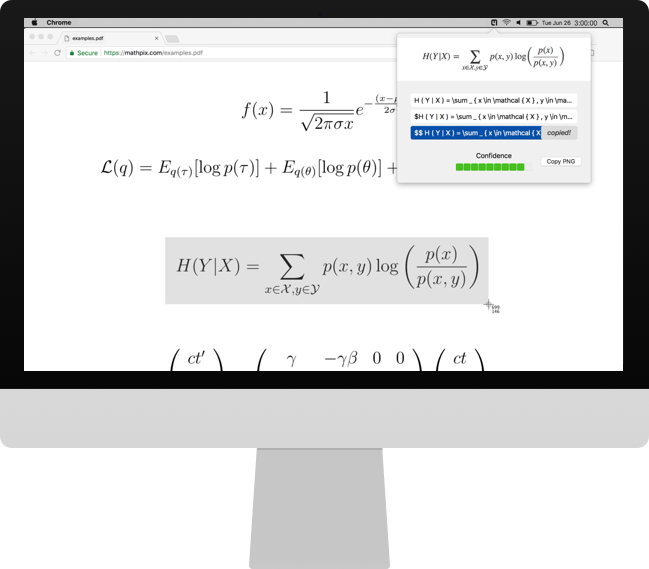
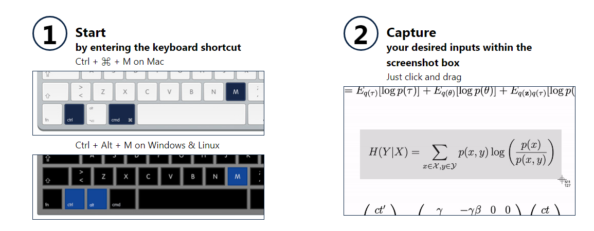
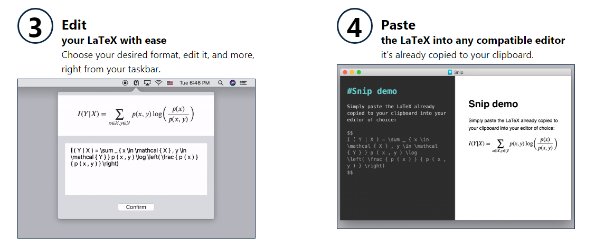
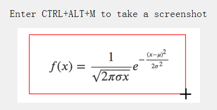
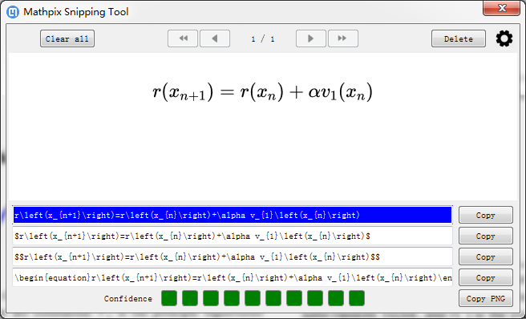
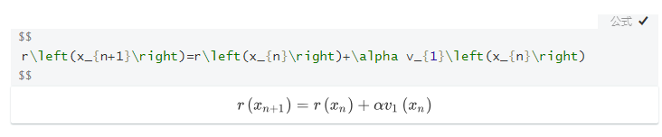

# Mathpix：一键识别数学公式

Markdown是写作神器，书写计算公式也很方便

但是自己一个个敲还是有点麻烦

如果你是从文献或者其他地方看到的数学公式，你可以利用[mathpix](https://mathpix.com)一键转换

## 下载mathpix

下载地址：https://mathpix.com

## 操作快捷键

## 直接弹出窗口

选中公式后，Mathpix会直接跳出窗口

## 选择你要的类型复制

`$.....$`是行内公式

`$$....$$`是行间公式

打开一个Markdown编辑器（强推Typora），复制公式

效果就出来啦~（简书也是Markdown，可以直接用）

$$
r\left(x_{n+1}\right)=r\left(x_{n}\right)+\alpha v_{1}\left(x_{n}\right)
$$

## 最后
这是某日，**Grit**在群里分享他学习笔记，大神**Austin.大卫**分享的小工具
试过之后，真好用！